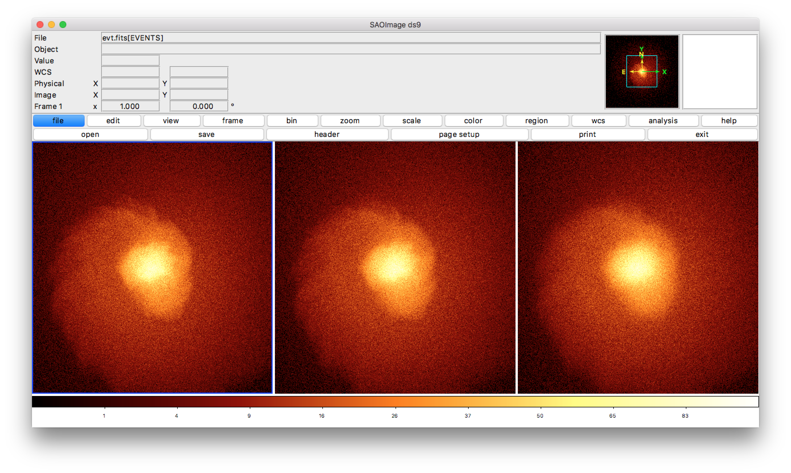

.. _change-instrument-spec:

Changing the Instrument Specification
=====================================

This script shows how to simulate a single source with different instrument specifications, 
including JSON files. We will make a small tweak to HDXI, by increasing the PSF size. This 
example requires pyXSIM.

.. code-block:: bash

    #!/bin/bash
    
    # First, we make a SIMPUT file of gas sloshing in a galaxy cluster core using the Python 
    # script which calls pyXSIM
    python make_sloshing.py
    
    # Next, we make three event files, using a different instrument specification for each
    
    # Normal HDXI with 0.5 arcsec PSF
    instrument_simulator sloshing_simput.fits evt.fits 50.0,ks lynx_hdxi 30.0,45.0 --overwrite
    
    # HDXI with 2 arcsec PSF
    instrument_simulator sloshing_simput.fits evt_2.fits 50.0,ks hdxi_2.json 30.0,45.0 --overwrite
    
    # HDXI with 5 arcsec PSF
    instrument_simulator sloshing_simput.fits evt_5.fits 50.0,ks hdxi_5.json 30.0,45.0 --overwrite

The ``make_sloshing.py`` script that is called:

.. code-block:: python

    import yt
    import pyxsim
    
    # This example simulates photons for a sloshing galaxy cluster core. 

    # Load the file using yt
    # This file can be obtained at http://yt-project.org/data/GasSloshing.tar.gz
    ds = yt.load("GasSloshing/sloshing_nomag2_hdf5_plt_cnt_0150")
    
    # We create a sphere at the center of the simulation domain with a radius of 500 kpc
    sp = ds.sphere("c", (500.,"kpc"))
    
    # We define our emission model to be a thermal model using the APEC tables.
    # Metallicity is the same everywhere with Z = 0.3 solar
    source_model = pyxsim.ThermalSourceModel("apec", 0.05, 11.0, 10000, Zmet=0.3,
                                             thermal_broad=True)
    
    # We set up some basic parameters to determine the sample
    exp_time = (50., "ks") # exposure time
    area = (3.0, "m**2") # collecting area
    redshift = 0.1
    
    # This line generates the photons
    n_photons, n_cells = pyxsim.make_photons("my_photons", sp, redshift, area, exp_time, source_model)
    
    # Project the photons along the z-axis and absorb them
    n_events = pyxsim.project_photons("my_photons", "my_events", "z", (30.0, 45.0),
                                      absorb_model="tbabs", nH=0.04)
    
    # Write the events to a SIMPUT catalog
    events = pyxsim.EventList("my_events.h5")
    events.write_to_simput("sloshing", overwrite=True)
    
Download these scripts and JSON files here: 

* `change_instrument_spec.sh <../change_instrument_spec.sh>`_
* `make_sloshing.py <../make_sloshing.py>`_
* `hdxi_2.json <../hdxi_2.json>`_
* `hdxi_5.json <../hdxi_5.json>`_

The result of this script are three event files with an increasingly broadened PSF, as shown
here:

