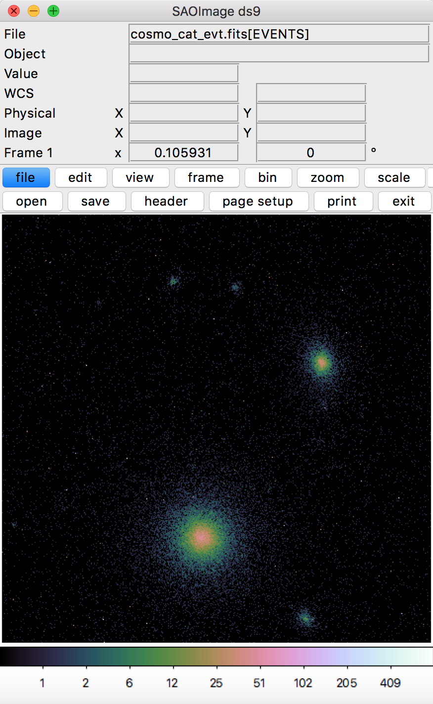

.. _cosmo-source-catalog-cmd:

Cosmological Source Catalog (Command-Line Version)
==================================================

This script shows how to make a tailor-made distribution of photons from a
distribution of cosmological halos and simulate an observation of them. 

.. code-block:: bash

    #!/bin/sh
        
    # Use this script to create a distribution of photons from cosmological
    # halos and simulate an observation.
    
    # First, make the photons from the halos into a SIMPUT catalog, saving
    # the halo properties to a table file and choosing "33" as a random seed
    # to insure we get the same sources every time. Set the catalog pointing
    # location using the "cat_center" argument. To aid in picking a location, 
    # see the halo map at http://hea-www.cfa.harvard.edu/~jzuhone/soxs/users_guide/source_catalog.html.
    make_cosmological_sources my_cat.simput cosmo 200.0,ks 20. 30.,45. --cat_center=3.1,-1.9 --random_seed=33 --overwrite --output_sources=halo_source_table.dat
 
    # Take the SIMPUT catalog and make an event file.
    instrument_simulator my_cat.simput cosmo_cat_evt.fits 200.0,ks lynx_hdxi 30.,45. --overwrite

Download this script here: `cosmo_source_catalog.sh <../cosmo_source_catalog.sh>`_

The resulting event file looks like this in ds9:

