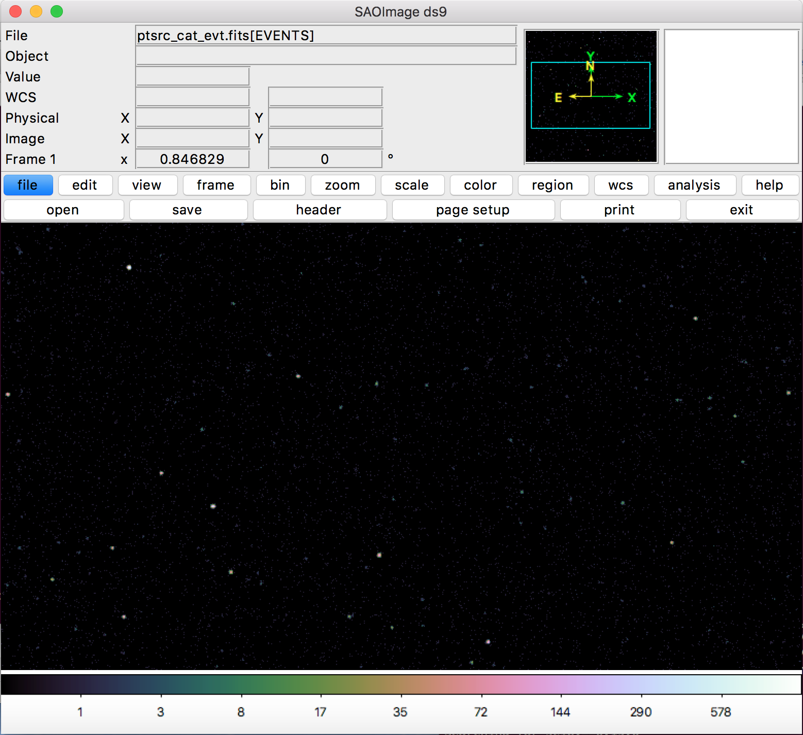

.. _make-background-file-cmd:

Make a Background File (Command-Line Version)
=============================================

The ``make_background_file`` command allows one to create an event file of 
a background for a particular instrument configuration. This event file can 
then be added as background to any source event file one creates using the
``instrument_simulator`` command. ``make_background_file``` also allows one 
to specify a particular set of point sources to make the point-source 
contribution to the background, or to create the point-source properties 
on the fly. In this example, we will show how to do the former using a
point source table created by ``make_point_source_list```. 

.. code-block:: bash

    #!/bin/sh
    
    # Use this script to make a background event file using a pre-made 
    # set of point sources.
    
    # First, make the point source properties using the make_point_source_list
    # command which saves the positions, fluxes, and spectral indices of the
    # sources to an ASCII table which can be read in by make_background_file.
    make_point_source_list point_source_table.dat 20. 22.,-27.0
    
    # Take the SIMPUT catalog and make an event file. Since we already made a
    # distribution of point sources, turn the point-source background off. 
    make_background_file bkgnd_evt.fits 300.0,ks lynx_hdxi 22.,-27.0 --overwrite --input_pt_sources=point_source_table.dat

Download this script here: `make_background_file.sh <../make_background_file.sh>`_

The resulting file will look like this in ds9:

