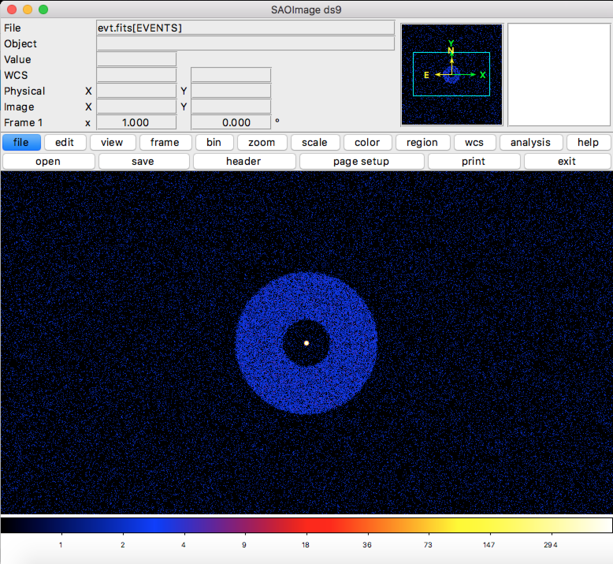

.. _make-multiple-sources:

Make Multiple Sources
=====================

This script shows how to create two sources with two different spectra and combine them
into a single SIMPUT catalog, which is then used to make a single event file.

.. code-block:: bash

    #!/bin/sh

    # We will use this script to illustrate how to combine multiple sources into
    # a single simput catalog from the command line.
    
    # First, make an absorbed thermal spectrum, which will be for an annulus source.
    make_thermal_spectrum 6.0 0.3 0.05 1.0e-4 thermal_spec.dat 0.1 10.0 10000 --absorb_model=wabs --nh 0.04 --overwrite
    
    # Second, make an absorbed power-law spectrum, which will be for a point source.
    make_powerlaw_spectrum 1.1 0.05 1.0e-4 powerlaw_spec.dat 0.1 10.0 10000 --absorb_model=wabs --nh 0.04 --overwrite
    
    # Take this spectrum and make a SIMPUT catalog with a point source photon list
    make_point_source my_cat.simput point_source 30.0 45.0 thermal_spec.dat --overwrite
    
    # Add an annulus source to the SIMPUT catalog, with the same center.
    make_annulus_source my_cat.simput annulus 30.0 45.0 10.0 30.0 thermal_spec.dat 25.0 3000 --append --overwrite
    
    # Take the SIMPUT catalog and make an event file
    instrument_simulator my_cat.simput evt.fits 50.0,ks lynx_hdxi 30.0,45.0 --overwrite

Download this script here: `make_multiple_sources.sh <../make_multiple_sources.sh>`_

The result of this script is an observation of an annulus with a point source in the center, which
looks like this in ds9:

