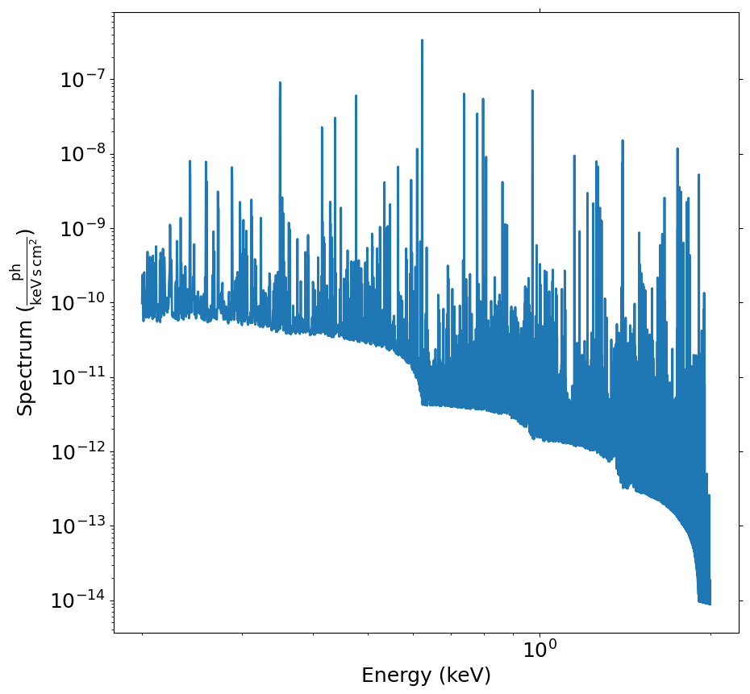
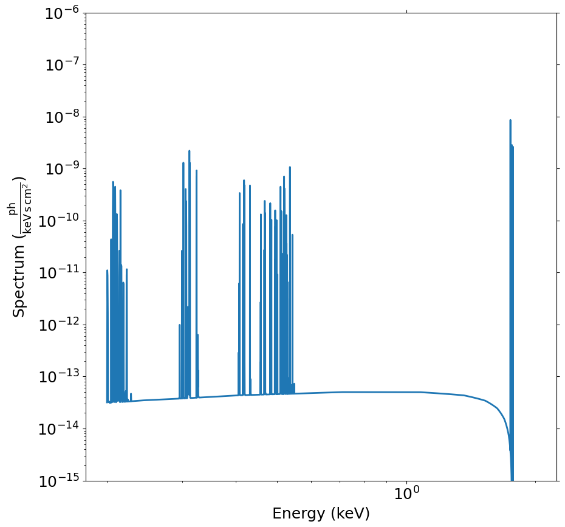

.. _charge-exchange:

Charge Exchange Spectra
=======================

The phenomenon of charge exchange is a process in which a neutral atom or molecule
collides with an ion, resulting in the transfer of an electron from the neutral atom
to the ion. The recombined ion is then left in an excited state, which can lead to
the emission of X-rays as the ion returns to its ground state. Charge exchange lines
may be expected in astrophysical situations where neutral atoms or molecules are in the
presence of highly ionized plasma, and there is a significant relative velocity between
the two.

Charge exchange spectra are typically characterized by a series of emission lines
(and continuum 2-photon emission from 2s-1s transitions). To implement charge
exchange spectra in SOXS, we use the ``acx2`` and ``pyatomdb`` packages, which are
optional dependencies and are not installed automatically when you install SOXS.

Installation
------------

.. |pyatomdb| replace:: install the ``pyatomdb`` package
.. _pyatomdb: https://atomdb.readthedocs.io/en/master/installation.html

.. |acx2| replace:: install the ``acx2`` package
.. _acx2: https://acx2.readthedocs.io/en/latest/#installation

To use the charge exchange model in SOXS, you must first |pyatomdb|_, which is a
Python package for atomic data and modeling of X-ray spectra. Following that, you
can |acx2|_.

Usage
-----

For the charge exchange spectral models implemented in SOXS, it is assumed that
the neutral or "donor" atoms are a combination of H and He, and that they collide
with a plasma of ions. The models that follow have two optional parameters that should
be noted. The most important optional parameter is that of the collision type
(``collntype``), which determines how the velocity between donor and receiver atoms
is characterized. There are four options for the type and units of the collision parameter:

1. Velocity is given by the center of mass energy (kev/amu)
2. Velocity is given by the center of mass velocity (km/s)
3. Velocity is given by the donor velocity in the lab frame (km/s)
4. Velocity is given by the recombining ion velocity in the lab frame (km/s)

In what follows, 1 is the default.

Another optional parameter is the recombination type (``recomb_type``), which determines
if the electrons have a (1) single recombination (2) full recombination all the way to
neutral or (3) full recombination normalized by the total cross section for each ion.
In what follows, option 1 is the default.

Two classes are provided to generate spectra; the first class,
:class:`~soxs.spectra.charge_exchange.ACX2Generator`, assumes that the
balance of ions in the recombining plasma can be determined by an input temperature.
We must also supply values for the collision parameter itself (based on the type),
the metal abundance of the recombining plasma, the fraction of helium in the
donor gas, the redshift of the source, and the normalization of the spectrum, which
is given by:

.. math::

    {\rm norm} = \frac{\int{n_{\rm H}^r}{n_{\rm H+He}^d}{dV}}{4 \pi D^2}

where :math:`D` is the distance to the source, :math:`n_{\rm H}^r` is the hydrogen
number density in the recombining plasma, and :math:`n_{\rm H+He}^d` is the number density
of the donor ions.

A typical invocation of setting up the :class:`~soxs.spectra.charge_exchange.ACX2Generator`
class and then generating a spectrum using its
:meth:`~soxs.spectra.charge_exchange.ACX2Generator.get_spectrum` method may look like this:

.. code-block:: python

    import soxs

    emin = 0.2
    emax = 2.0
    nbins = 6000
    collntype = 1 # Collision type: center of mass energy in keV/amu

    # First set up the generator of spectra
    cxgen = soxs.ACX2Generator(emin, emax, nbins, collntype=collntype)

    # Now generate a single spectrum
    kT = 1.0 # temperature of recombining plasma in keV
    collnpar = 1.0 # collision parameter in keV/amu
    abund = 1.0 # metal abundance of the recombining plasma in solar units
    He_frac = 0.09 # fraction of helium in the donor gas, rest is assumed
                   # to be hydrogen
    redshift = 0.05 # redshift of the source
    norm = 1.0 # normalization of the spectrum
    spec = cxgen.get_spectrum(kT, collnpar, abund, He_frac, redshift, norm)

which gives a spectrum that looks like this:

In this case, it would also be possible to include broadening of the emission
lines from either thermal or velocity broadening in this way:

.. code-block:: python

    velocity = (200.0, "km/s")
    tbroad = (0.1, "keV") # note that this is not necessarily the same as kT
    spec = cxgen.get_spectrum(kT, collnpar, abund, He_frac, redshift, norm,
                              velocity=velocity, tbroad=tbroad)

In the above example, the ``abund`` parameter sets the abundances of non H/He
atoms in the recombining plasma, assuming an abundance table. The table of abundances
can be altered by setting the ``abund_table`` argument (default is ``"angr"``):

.. code-block:: python

    cxgen = soxs.ACX2Generator(emin, emax, nbins, collntype=collntype, abund_table="lodd")

See :ref:`changing-abund-tables` to see the various options available. You can
also set the abundances of individual elements by hand. First, in the
construction of the :class:`~soxs.spectra.charge_exchange.ACX2Generator` class,
set ``var_elem`` equal to a list of elements that you would like to vary independently
of the abundance table:

.. code-block:: python

    var_elem = ["O", "N", "He"]
    cxgen = soxs.ACX2Generator(emin, emax, nbins, collntype=collntype, var_elem=var_elem)

Then, in the call to :meth:`~soxs.spectra.charge_exchange.ACX2Generator.get_spectrum`,
you can set the abundances of the elements in the list ``var_elem`` by passing a dict
of values for these elements as the ``elem_abund`` argument like so:

.. code-block:: python

    elem_abund = {"O": 0.5, "N": 0.7, "He": 0.7}
    spec = cxgen.get_spectrum(kT, collnpar, abund, He_frac, redshift, norm,
                              elem_abund=elem_abund)

The second class that can be used to create charge exchange spectra is
:class:`~soxs.spectra.charge_exchange.OneACX2Generator`, which instead of a large
number of ions assumes a single recombining ion. The setup for the class is essentially
the same as the :class:`~soxs.spectra.charge_exchange.ACX2Generator` class (though it
is not possible to set the ``var_elem`` argument since there is only one ion):

.. code-block:: python

    import soxs

    emin = 0.2
    emax = 2.0
    nbins = 6000
    collntype = 2 # Collision type: center of mass velocity in km/s

    ocxgen = soxs.OneACX2Generator(emin, emax, nbins, collntype=collntype)

Then, we can use the :meth:`~soxs.spectra.charge_exchange.OneACX2Generator.get_spectrum`
method to get the spectrum. Here, you can set the element and ion that you want to
model:

.. code-block:: python

    elem = "Si" # The atomic number or symbol of the element.
    ion = 13 # The ionization state of the element.
    collnpar = (100.0, "km/s") # collision parameter
    He_frac = 0.09 # fraction of helium in the donor gas, rest is assumed
                   # to be hydrogen
    redshift = 0.05 # redshift of the source
    norm = 1.0 # normalization of the spectrum

    spec = ocxgen.get_spectrum(elem, ion, collnpar, He_frac, redshift, norm)

which gives a spectrum that looks like this:

