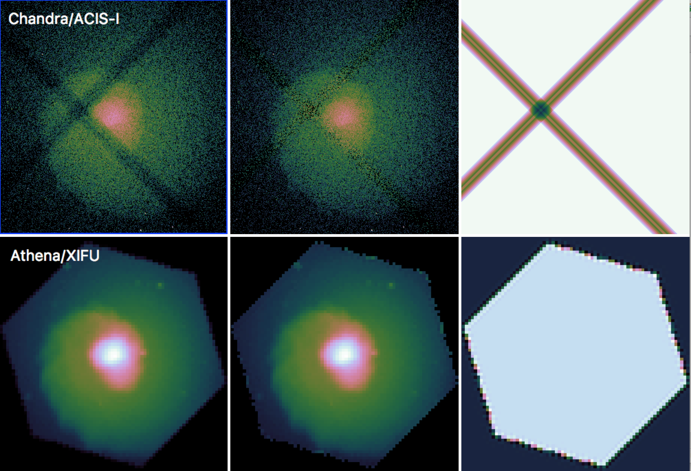
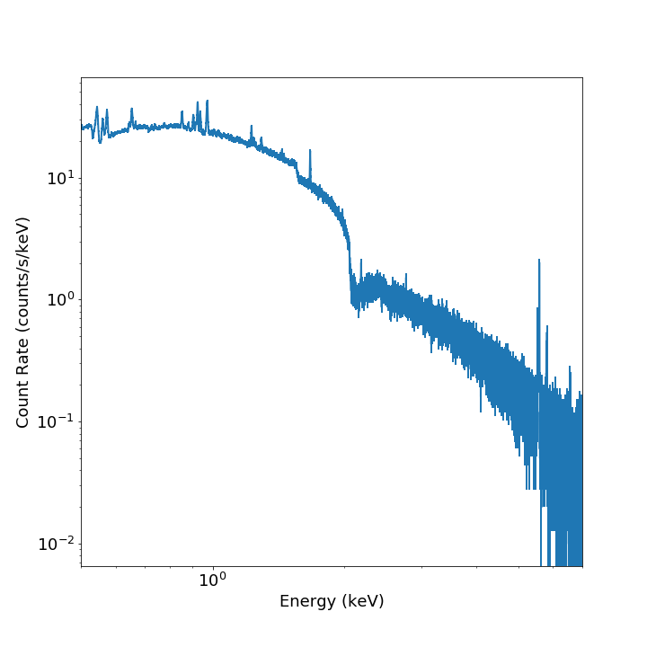
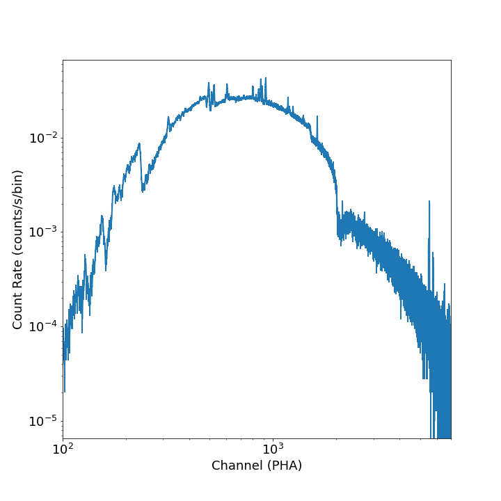

.. _event-tools:

Event File Tools
================

This section documents some helpful tools to take event files produced by the SOXS instrument
simulator and make derivative products from them. 

``filter_events``
-----------------

.. _filtering-events:

The :func:`~soxs.events.filter_events` function is used to filter event files on event 
position or energy, and make a new event file. This may be useful if you want to analyze
a subset of the data only. To filter out events based on energy:

.. code-block:: python

    # Filter out everything less than 0.5 keV
    soxs.filter_events("evt.fits", "evt_lt0.5.fits", emin=0.5, overwrite=True)

    # Filter out everything greater than 2.0 keV
    soxs.filter_events("evt.fits", "evt_gt2.0.fits", emin=2.0, overwrite=True)

    # Filter out everything except within the 0.1-3.0 eV band
    soxs.filter_events("evt.fits", "evt_gt2.0.fits", emin=0.1, emax=3.0, overwrite=True)

To filter out events based on position, we use a region file from ds9, CIAO, etc.:

.. code-block:: python

    soxs.filter_events("evt.fits", "evt_circle.fits", region="circle.reg",
                       overwrite=True)
                       
Alternatively, you can use a region string:

.. code-block:: python
 
    reg = '# Region file format: DS9\nimage\ncircle(147.10,254.17,3.1) # color=green\n'
    soxs.filter_events("evt.fits", "evt_circle.fits", region=reg,
                       overwrite=True)

Energy and region filtering can be combined:

.. code-block:: python

    soxs.filter_events("evt.fits", "evt_circle.fits", region="circle.reg",
                       overwrite=True, emin=0.1, emax=0.5)

``make_exposure_map``
---------------------

Exposure maps are maps of exposure for a given X-ray energy or range of energies, giving the
effective exposure as a function of position on the sky. Uneven exposure may occur because
of spacecraft dithering, chip gaps, or differences in effective area at different points on a
chip (though the latter effect is currently not simulated in SOXS). For a more thorough
explanation of exposure maps, see 
`Introduction to Exposure Maps <http://cxc.harvard.edu/ciao/download/doc/expmap_intro.ps>`_.

:func:`~soxs.events.make_exposure_map` creates an exposure map for SOXS event files. This may 
be needed particularly if you have a simulation with dither and are concerned about effects
near the edges of chips, but it will work for any event file produced by SOXS. This function
determines the effective area for a given input energy or range of energies weighted by a 
spectrum, and then uses the aspect solution (the RA and Dec of the spacecraft pointing as
a function of time) to create a histogram of aspect to determine how much time a given detector 
coordinate spent on a given sky location. These pieces of information are then used to produce 
a map of total exposure for the observation in sky coordinates. Exposure maps can be 
"reblocked" to a lower resolution, and this will typically speed up the computation of the
exposure map.

To make an exposure map with the default parameters using an energy of 4.0 keV:

.. code-block:: python

    import soxs
    soxs.make_exposure_map("my_evt.fits", "my_expmap.fits", 4.0, overwrite=True)
    
If you have an idea of what the spectrum of the object is, you can alternatively
use an energy range and the spectrum itself as a set of "weights" to make a weighted
exposure map. This example uses a :class:`~soxs.spectra.Spectrum` object ``spec``:

.. code-block:: python

    import soxs
    
    energy = spec.emid.value
    weights = spec.flux.value
    
    soxs.make_exposure_map("my_evt.fits", "my_expmap.fits", energy, weights=weights,
                           overwrite=True)

By default, exposure maps are computed in units of :math:`\rm{cm^2} \times \rm{s}` and then 
divided by the exposure time to get a map in units of :math:`\rm{cm}^2`. To turn off this
normalization and get a map in units of :math:`\rm{cm^2} \times \rm{s}`, set ``normalize=False``:

.. code-block:: python

    import soxs
    soxs.make_exposure_map("my_evt.fits", "my_expmap.fits", 4.0, 
                           overwrite=True, normalize=False)

To write the aspect solution to a file, set the ``asol_file`` keyword to the file you
want to use:

.. code-block:: python

    import soxs
    soxs.make_exposure_map("my_evt.fits", "my_expmap.fits", 4.0, 
                           overwrite=True, asol_file="my_asol.fits")

By default, the aspect is binned into a histogram of 16x16 bins covering the range 
of the aspect solution pattern. To change this binning, use the ``nhistx`` and ``nhisty``
keywords:

.. code-block:: python

    import soxs
    soxs.make_exposure_map("my_evt.fits", "my_expmap.fits", 4.0, 
                           overwrite=True, nhistx=32, nhisty=32)

To create an exposure map with pixels 4 times larger on a side, set the ``reblock``
parameter to 4:

.. code-block:: python

    import soxs
    soxs.make_exposure_map("my_evt.fits", "my_expmap.fits", 4.0, 
                           overwrite=True, reblock=4)

Examples of images and exposure maps for a simulation of a galaxy cluster for *Chandra*/ACIS-I
and *Athena*/XIFU are shown in Figure 1. 

    Figure 1: Images (left), exposure-corrected images (center) and exposure maps (right)
    for mock observations of a galaxy cluster for *Chandra*/ACIS-I (top) and *Athena*/XIFU 
    (bottom), simulated using SOXS.

.. warning::

    The :func:`~soxs.events.make_exposure_map` tool only produces exposure maps for event
    files produced by SOXS, and this is the only tool that should be used for this purpose
    for event files produced by SOXS.

``write_image``
---------------

:func:`~soxs.events.write_image` bins up events into an image according to the coordinate
system inherent in the event file and writes the image to a FITS file. Images of sky, detector,
or chip coordinates can be written. You can also restrict events within a particular energy range 
to be written to the file.

To write an image in sky coordinates:

.. code-block:: python

    from soxs import write_image
    # Energy bounds are in keV
    write_image("my_evt.fits", "my_sky_img.fits", emin=0.5, emax=7.0)
    
Or in detector coordinates:

.. code-block:: python

    write_image("my_evt.fits", "my_sky_img.fits", coord_type='det', emin=0.5, emax=7.0)

Or in chip coordinates:

.. code-block:: python

    write_image("my_evt.fits", "my_sky_img.fits", coord_type='sky', emin=0.5, emax=7.0)

To supply an exposure map produced by :func:`~soxs.events.make_exposure_map` to make a
flux image:

.. code-block:: python

    write_image("my_evt.fits", "my_sky_img.fits", coord_type='sky', emin=0.5, emax=7.0,
                expmap_file="my_expmap.fits")

To bin at a pixel size 4 times larger than the native pixel size, set ``reblock`` to 4:

.. code-block:: python

    write_image("my_evt.fits", "my_sky_img.fits", coord_type='sky', emin=0.5, emax=7.0,
                expmap_file="my_expmap.fits", reblock=4)

Note that if you set ``reblock`` and supply an exposure map, it must have been made with
the same value of ``reblock``.

This image can then be viewed in `ds9 <http://ds9.si.edu>`_ or `APLpy <https://aplpy.github.io>`_.

``write_radial_profile``
------------------------

:func:`~soxs.events.write_radial_profile` bins up events into an radial profile defined by source 
center, a minimum radius, a maximum radius, and a number of bins. One can restrict the events that 
are binned by a specific energy band. An example execution:

.. code-block:: python

    from soxs import write_radial_profile
    ctr = [30.0, 45.0] # by default the center is in celestial coordinates
    rmin = 0.0 # arcseconds
    rmax = 100.0 # arcseconds
    nbins = 100 # number of bins
    emin = 0.5 # keV
    emax = 2.0 # keV
    write_radial_profile("my_evt.fits", "my_radial_profile.fits", ctr, rmin,
                         rmax, nbins, emin=emin, emax=emax, overwrite=True)

If one wants to specify a center in physical pixel coordinates, you can use the same execution but
set the ``ctr_type`` keyword to "physical" and use physical pixel coordinates as the ``ctr`` argument:

.. code-block:: python

    from soxs import write_radial_profile
    ctr = [2048.5, 2048.5] # by default the center is in celestial coordinates
    rmin = 0.0 # arcseconds
    rmax = 100.0 # arcseconds
    nbins = 100 # number of bins
    emin = 0.5 # keV
    emax = 2.0 # keV
    write_radial_profile("my_evt.fits", "my_radial_profile.fits", ctr, rmin,
                         rmax, nbins, ctr_type="physical", emin=emin, emax=emax, 
                         overwrite=True)

If one wants to compute flux-based quantities for the radial profile (such as surface flux), 
supply an exposure map produced by :func:`~soxs.events.make_exposure_map`:

.. code-block:: python

    write_radial_profile("my_evt.fits", "my_radial_profile.fits", ctr, rmin,
                         rmax, nbins, ctr_type="physical", emin=emin, emax=emax, 
                         expmap_file="my_expmap.fits", overwrite=True)

A cookbook example showing how to extract a radial profile is shown in 
`Radial Profile <../cookbook/Radial_Profile.ipynb>`_.

.. _write-spectrum:

``write_spectrum``
------------------

:func:`~soxs.events.write_spectrum` bins up events into a spectrum and writes the spectrum
to a FITS file:

.. code-block:: python

    from soxs import write_spectrum
    write_spectrum("my_evt.fits", "my_spec.pha", overwrite=True)

This spectrum file can be read and fit with standard X-ray analysis software such as 
`XSPEC <https://heasarc.gsfc.nasa.gov/xanadu/xspec/>`_, `ISIS <http://space.mit.edu/CXC/ISIS/>`_, 
and `Sherpa <http://cxc.harvard.edu/sherpa/>`_. 

.. _plot-spectrum:

``plot_spectrum``
-----------------

:func:`~soxs.events.plot_spectrum` reads a spectrum stored in a FITS table file and makes
a `Matplotlib <http://www.matplotlib.org>`_ plot. There are a number of options for 
customizing the plot in the call to :func:`~soxs.events.plot_spectrum`, but the method 
also returns a tuple of the :class:`~matplotlib.figure.Figure` and the 
:class:`~matplotlib.axes.Axes` objects to allow for further customization. This example
opens up a spectrum file and plots it between 0.5 and 7.0 keV:

.. code-block:: python

    from soxs import plot_spectrum
    plot_spectrum("evt.pha", xmin=0.5, xmax=7.0)

If one wanted to plot the same spectrum in channel space instead of energy space, you
would set ``plot_energy=False``:

.. code-block:: python

    from soxs import plot_spectrum
    plot_spectrum("evt.pha", plot_energy=False, xmin=300, xmax=7000)

where in that case the x-axis is now in channel space, so ``xmin`` and ``xmax`` had to
be set accordingly. 

To bin the spectrum in energy bins of your choice, generate a set of bin edges and pass
them to :func:`~soxs.events.plot_spectrum` using the ``ebins`` argument:

.. code-block:: python

    from soxs import plot_spectrum
    import numpy as np
    ebins = np.linspace(0.5, 7.0, 101)
    plot_spectrum("evt.pha", ebins=ebins, xmin=0.5, xmax=7.0)

For other customizations, consult the :func:`~soxs.events.plot_spectrum` API. 

``plot_image``
--------------

The :func:`~soxs.events.plot_image` function allows one to plot an image from a FITS
file. Several examples of this are shown in the following cookbook recipes:

* `Two Clusters <../cookbook/Two_Clusters.ipynb>`_
* `pyXSIM Example <../cookbook/pyXSIM_Example.ipynb>`_
* `Make Background File <../cookbook/Make_Background_File.ipynb>`_
* `Point Source Catalog  <../cookbook/Point_Source_Catalog.ipynb>`_
* `Cosmological Source Catalog <../cookbook/Cosmo_Source_Catalog.ipynb>`_

For the full range of customizations, consult the :func:`~soxs.events.plot_image` API. 
