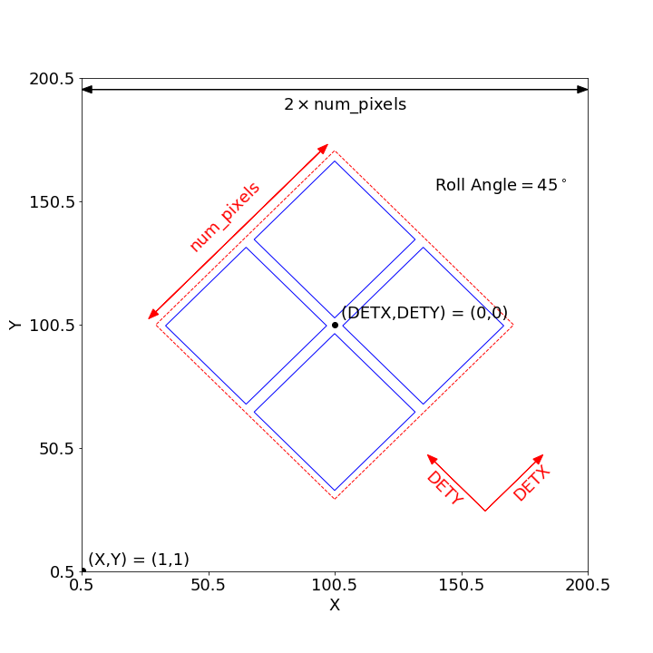
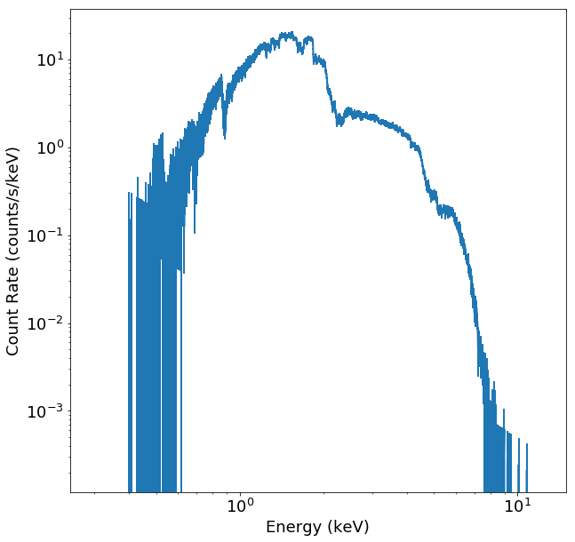

.. _instrument:

Instrument Simulation in SOXS
=============================

Running the Instrument Simulator
--------------------------------

The end product of a mock observation is a "standard" event file which has been 
convolved with a model for the telescope. In SOXS, this is handled by the
instrument simulator. 

:func:`~soxs.instrument.instrument_simulator` reads in a SIMPUT catalog and 
creates a standard event file using the instrument simulator. 
:func:`~soxs.instrument.instrument_simulator` performs the following actions:

1. Uses the effective area curve to determine which events will actually be 
   detected.
2. Projects these events onto the detector plane and perform PSF blurring and 
   dithering of their positions (if dithering is enabled for that particular
   instrument).
3. Add background events.
4. Convolves the event energies with the response matrix to produce channels.
5. Writes everything to an event file.

All of the photon lists in the SIMPUT catalog will be processed. A typical 
invocation of :func:`~soxs.instrument.instrument_simulator` looks like the 
following:

.. code-block:: python

    from soxs import instrument_simulator
    simput_file = "snr_simput.fits" # SIMPUT file to be read
    out_file = "evt_lxm.fits" # event file to be written
    exp_time = (30.0, "ks") # The exposure time
    instrument = "lynx_lxm" # short name for instrument to be used
    sky_center = [30., 45.] # RA, Dec of pointing in degrees
    instrument_simulator(simput_file, out_file, exp_time, instrument, 
                         sky_center, overwrite=True)
 
The ``overwrite`` argument allows an existing file to be overwritten. We now
describe instrument simulation in more detail.

.. _instrument-arg:

The ``instrument`` Argument
+++++++++++++++++++++++++++

SOXS currently supports instrument configurations for *Lynx*, *Athena*, 
*Chandra*, *XRISM*, *AXIS*, and *STAR-X* "out of the box". Any of these can be 
specified with the ``instrument`` argument:

Lynx
~~~~

All *Lynx* configurations correspond to the :math:`d = 3~m, f = 10~m` mirror 
system.

Imaging
#######

For *Lynx*, there are currently four base imaging instruments, ``"lynx_hdxi"`` 
for the High-Definition X-ray Imager (HDXI), and the three subarrays of the 
*Lynx* X-ray Microcalorimeter (LXM): the Main Array (``"lynx_lxm"``), the 
Enhanced Main Array (``"lynx_lxm_enh"``), and the Ultra High-Resolution Array
(``"lynx_lxm_ultra"``). 

The HDXI has a single square-shaped 20-arcminute field of view, and the three
different subarrays for the LXM have different plate scales, field of view, 
and spectral resolutions. They are:

* ``"lynx_lxm"``: 5' field of view, 1" pixels, 3 eV spectral resolution 
* ``"lynx_lxm_enh"``: 1' field of view, 0.5" pixels, 1.5 eV spectral resolution
* ``"lynx_lxm_ultra"``: 1' field of view, 1" pixels, 0.3 eV spectral resolution
  (restricted to energies below ~1 keV)

The default instrumental background in SOXS for the ``"lynx_hdxi"`` model is the 
*Chandra*/ACIS-I particle background, and the default instrumental background
for the ``"lynx_lxm_*"`` models is based on a model developed for the *Athena* 
calorimeter 
(`see here for details <http://adsabs.harvard.edu/abs/2014A%26A...569A..54L>`_).

Gratings
########

A single gratings instrument specification for *Lynx* is included with SOXS,
the *Lynx* X-ray Gratings Spectrometer, ``"lynx_xgs"``, which currently only 
allows simulations of spectra. It corresponds approximately to the 
:math:`d = 3~m, f = 10~m` mirror system, 50% coverage of the input aperture 
by the gratings, and :math:`R = 5000`.

Athena
~~~~~~

For simulating *Athena* observations, two instrument specifications are 
available, for the WFI (Wide-Field Imager) and the X-IFU (X-ray Integral Field 
Unit). For both of these specifications, a 12-meter focal length is assumed.
The PSF model, response files, and background models are used from the 
`SIXTE <https://www.sternwarte.uni-erlangen.de/research/sixte/index.php>`_ 
software package. The WFI detector consists of four chips laid out in a 2x2 
shape with a field of view of approximately 40 arcminutes, and the X-IFU 
detector has a single hexagonal shape with an approximate diameter of 5 
arcminutes. 

Chandra
~~~~~~~

For simulating *Chandra* observations, a number of instrument specifications are 
available. All specifications assume a 10-meter focal length, dithering, and 
0.492-arcsecond pixels. They also include a simplified model for the on and 
off-axis *Chandra* PSF.
 
The default instrumental background in SOXS for the *Chandra* ACIS-I models is 
the *Chandra*/ACIS-I particle background. For ACIS-S, the ACIS-I background is
used for the front-illuminated chips, and a model provided by Andrea Botteon 
from `Botteon et al. 2017 <http://adsabs.harvard.edu/abs/2017arXiv170707038B>`_ 
is used for the back-illuminated chips. Currently, the gratings instrument 
models do not have instrumental backgrounds included.

ACIS-I
######

The two ACIS-I specifications have a square field of view of roughly 20 
arcminutes, laid out in four chips 8 arcminutes on a side arranged 2x2. However,
The two separate specifications, ``"chandra_acisi_cy0"`` and 
``"chandra_acisi_cy22"``, use the instrumental responses from shortly after 
launch ("Cycle 0") and from more recently ("Cycle 22"), respectively. The main 
effect is that the effective area at low energies for ``"chandra_acisi_cy22"`` 
is much lower due to the buildup of contamination on the ACIS optical blocking 
filters compared to the ``"chandra_acisi_cy0"`` responses.

ACIS-S
######

The two ACIS-S specifications have 6 chips 8 arcminutes on a side in a single 
row. As in the ACIS-I case, the two specifications are for Cycle 0 
``"chandra_aciss_cy0"``, and Cycle 22, ``"chandra_aciss_cy22"``. 

HETG
####

Eight gratings specifications have been included for ACIS-S and the HETG, for 
both Cycle 0 and Cycle 20. These simulate spectra only for the MEG and HEG, for 
the :math:`\pm` first order spectra. They are named:

* ``"chandra_aciss_meg_m1_cy0"``
* ``"chandra_aciss_meg_p1_cy0"``
* ``"chandra_aciss_heg_m1_cy0"``
* ``"chandra_aciss_heg_p1_cy0"``
* ``"chandra_aciss_meg_m1_cy20"``
* ``"chandra_aciss_meg_p1_cy20"``
* ``"chandra_aciss_heg_m1_cy20"``
* ``"chandra_aciss_heg_p1_cy20"``

.. _xrism:

XRISM
~~~~~

A single instrument specification is available for *XRISM*, for the "Resolve"
microcalorimeter instrument, named ``"xrism_resolve"``. It has a 5.6-meter focal 
length, no dithering, a 3-arcminute field of view, and 0.5-arcminute pixels. The
ARF assumes the full PSF without detector boundary, and an extended source flat
model. The response files, PSF model, and instrumental background model used for
*XRISM*/Resolve in SOXS were obtained from 
`here <https://heasarc.gsfc.nasa.gov/docs/xrism/proposals/index.html>`_.

.. _axis:

AXIS
~~~~

A single instrument specification ``"axis"`` is available for 
`AXIS <http://axis.astro.umd.edu>`_, the Advanced X-ray Imaging Satellite. 
The specification is for the wide-field imaging instrument, with a 24' field of 
view and a 9.5 m focal length. Response files, the PSF model, and the 
instrumental background model are used from the 
`SIXTE <https://www.sternwarte.uni-erlangen.de/research/sixte/index.php>`_ 
software package.

.. _starx:

STAR-X
~~~~~~

A single instrument specification ``"star-x"`` is available for 
`*STAR-X* <https://www.spiedigitallibrary.org/conference-proceedings-of-spie/10399/1039908/The-STAR-X-X-Ray-Telescope-Assembly-XTA/10.1117/12.2272580.short?SSO=1>`_.
The specification is for the wide-field imaging istrument, with a 1 degree field
of view, a 4.5 m focal length, and a Gaussian PSF with a FWHM of 3 arcseconds.
Currently, no instrumental background is included. The response files for 
*STAR-X* were provided by Michael McDonald.

.. _lem:

Light Element Mapper (LEM)
~~~~~~~~~~~~~~~~~~~~~~~~~~

Two instrument specifications ``"lem_2eV"`` and ``"lem_0.9eV"``, are 
available for the `Light Element Mapper (LEM) <https://lem.physics.wisc.edu>`_.
This specification has a 32 arcminute field of view, a 4 m focal length, 
an Gaussian PSF with a FWHM of 10 arcseconds. Currently, no instrumental 
background is included. The response files for *LEM* were provided 
`here <https://lem.physics.wisc.edu/LEM.html>`_.

.. _bkgnds:

Backgrounds
+++++++++++

The instrument simulator simulates background events as well as the source
events provided by the user. There are three background components: the 
Galactic foreground, a background comprised of discrete point sources, and the 
instrumental/particle background. Complete information about these components 
can be found in :ref:`background`, but here the keyword arguments pertaining to
backgrounds for :func:`~soxs.instrument.instrument_simulator` will be detailed. 

The various background components can be turned on and off using 
the ``ptsrc_bkgnd``, ``instr_bkgnd``, and ``foreground`` arguments. They are all
on by default, but can be turned on or off individually:

.. code-block:: python

    # turns off the astrophysical background but leaves in the instrumental
    instrument_simulator(simput_file, out_file, exp_time, instrument, 
                         sky_center, overwrite=True, instr_bkgnd=False,
                         foreground=True) # ptsrc_bkgnd True by default

For long exposures, backgrounds may take a long time to generate. For this
reason, SOXS provides a way to add a background stored in a previously
generated event file to the simulation of a source, via the ``bkgnd_file``
argument:

.. code-block:: python

    # loads the background from a file
    instrument_simulator(simput_file, out_file, exp_time, instrument, 
                         sky_center, overwrite=True, bkgnd_file="my_bkgnd.fits") 

In this case the values of ``instr_bkgnd``, ``ptsrc_bkgnd``, and ``foreground``
are ignored regardless of their value. The required background event file can be
generated using :func:`~soxs.instrument.make_background_file`, and is documented
at :ref:`make-bkgnd`. The background event file must be for the same instrument 
as the one that is being simulated for the source and must have an exposure time
at least as long as the source exposure. 

.. _coords:

Coordinate Systems in SOXS
--------------------------

SOXS event files produced by the instrument simulator have two coordinate 
systems: the (X, Y) "sky" coordinate system and the (DETX, DETY) "detector" 
coordinate system.

For a given instrument, the detector coordinate system is defined by a square
field of view divided into a number of pixels on each side. The field of view is 
shown in the schematic diagram in Figure 1 as the dashed red square. The center 
of the field of view has detector coordinates 0,0, as can be seen in Figure 1. 

The sky coordinate system is defined to be twice the size of the field of view,
with twice as many pixels. The center of the sky coordinate system is given by 
pixel coordinates ``0.5*(2*num_pixels+1),0.5*(2*num_pixels+1)``. The sky 
coordinate system is also shown in Figure 1. In event files and images, standard 
world coordinate system (WCS) keywords are used to translate between sky 
coordinates and RA and Dec. 

    Figure 1: Schematic showing the layout of sky and detector coordinate 
    systems, as well as multiple chips, for an example instrument similar to 
    *Chandra*/ACIS-I. A roll angle of 45 degrees has been specified. 

If the ``roll_angle`` parameter of the instrument simulation is 0, the sky and 
detector coordinate systems will be aligned, but otherwise they will not. Figure 
1 shows the orientation of the detector in the sky coordinate system for a roll 
angle of 45 degrees. For observations which have dither, the sky coordinates and 
the detector coordinates will not have a one-to-one mapping, but will change as 
a function of time. 

Finally, Figure 1 also shows that multiple "chips" can be specified. In SOXS,
chips are simply elements which are capable of detecting X-ray photons. Only 
events which fall within chip regions are detected. For more information on how
multiple chips can be specified for a particlular instrument, see :ref:`chips`.

.. warning::

    At the present time, the coordinate systems specified in SOXS do not 
    correspond directly to those systems in event files produced by actual 
    X-ray observatories. This is particularly true of detector coordinates. 
    The conventions chosen by SOXS are mainly for convenience. 

.. _other-mods:

Other Modifications
+++++++++++++++++++

You can also change other aspects of the observation with 
:func:`~soxs.instrument.instrument_simulator`. For example, you can change the
size and period of the Lissajous dither pattern, for instruments which have 
dithering enabled. The default dither pattern has amplitudes of 8.0 arcseconds 
in the DETX and DETY directions, and a period of 1000.0 seconds in the DETX 
direction and a period of 707.0 seconds in the DETY direction. You can change
these numbers by supplying a list of parameters to the ``dither_params`` 
argument:

.. code-block:: python

    import soxs
    # The order of dither_params is [x_amp, y_amp, x_period, y_period]
    # the units of the amplitudes are in arcseconds and the periods are in
    # seconds
    dither_params = [8.0, 16.0, 1000.0, 2121.0]
    soxs.instrument_simulator(simput_file, out_file, exp_time, instrument, 
                              sky_center, overwrite=True, 
                              dither_params=dither_params)
    
To turn dithering off entirely for instruments that enable it, use the 
``no_dither`` argument:

.. code-block:: python

    import soxs
    soxs.instrument_simulator(simput_file, out_file, exp_time, instrument, 
                              sky_center, overwrite=True, 
                              no_dither=True)

.. note:: 

    Dithering will only be enabled if the instrument specification allows for 
    it. For example, for *Lynx*, dithering is on by default, but for *XRISM* 
    it is off. 

To move the aimpoint of the observation away from the nominal aimpoint on the
detector, use the ``aimpt_shift`` argument, which is a two-element array of 
numbers (assumed units of arcseconds) which will shift the aimpoint by those
values:

.. code-block:: python

    import soxs
    soxs.instrument_simulator(simput_file, out_file, exp_time, instrument, 
                              sky_center, overwrite=True, 
                              aimpt_shift=[10.0,-20.0])

.. _simulate-spectrum:

Simulating Spectra Only 
-----------------------

If you would like to use an instrument specification and a 
:class:`~soxs.spectra.Spectrum` object to generate a spectrum file only (without
including spatial effects), SOXS provides a function 
:func:`~soxs.instrument.simulate_spectrum` which can take an unconvolved
spectrum and generate a convolved one from it. This is similar to what the XSPEC
command "fakeit" does. 

.. code-block:: python

    spec = soxs.Spectrum.from_file("lots_of_lines.dat")
    instrument = "lynx_lxm"
    out_file = "lots_of_lines.pha"
    simulate_spectrum(spec, instrument, exp_time, out_file, overwrite=True)

This spectrum file then can be read in and analyzed by standard software such as
XSPEC, Sherpa, ISIS, etc. 

The different background components that can be included in the 
:func:`~soxs.instrument.instrument_simulator` can also be used with 
:func:`~soxs.instrument.simulate_spectrum`. Because in this case the components
are assumed to be diffuse, it is necessary to specify an area on the sky
that the background was "extracted" from using the ``bkgnd_area`` parameter. 
Here is an example invocation:

.. code-block:: python

    spec = soxs.Spectrum.from_file("lots_of_lines.dat")
    instrument = "lynx_lxm"
    out_file = "lots_of_lines.pha"
    simulate_spectrum(spec, instrument, exp_time, out_file, 
                      ptsrc_bkgnd=True, foreground=True, 
                      instr_bkgnd=True, overwrite=True, 
                      bkgnd_area=(1.0, "arcmin**2"))

However, there are a couple of differences. The first difference is that 
backgrounds are turned off in :func:`~soxs.instrument.simulate_spectrum` by 
default, unlike in :func:`~soxs.instrument.instrument_simulator`. The second 
difference is that while for the :func:`~soxs.instrument.instrument_simulator` 
the point-source background is resolved into invdividual point sources, it is 
not resolved for :func:`~soxs.instrument.simulate_spectrum`, and instead is 
modeled using an absorbed power-law with the following parameters:

* Power-law index :math:`\alpha = 1.52`
* Normalization at 1 keV of :math:`2.0 \times 10^{-7} \rm{photons~cm^{-2}~keV^{-1}}`
* Neutral hydrogen column of :math:`0.018 \times 10^{22}~\rm{cm}^{-2}` 

Here the ``wabs`` model is assumed for the absorption. To change the default
absorption model or the neutral hydrogen column, use the :ref:`config`. Similarly,
the :ref:`config` can be used to change the APEC model version for the foreground.

Instrument specifications with the ``"imaging"`` keyword set to ``False`` can 
only be used with :func:`~soxs.instrument.simulate_spectrum` and not 
:func:`~soxs.instrument.instrument_simulator`. Currently, this includes grating 
instruments.

.. _gratings:

A Note About Simulations with Grating Instruments
-------------------------------------------------

Currently in SOXS, simulations of sources observed by grating instruments are 
not supported with the :func:`~soxs.instrument.instrument_simulator`. Gratings
observations can be generated using :class:`~soxs.spectra.Spectrum` objects
and :func:`~soxs.instrument.simulate_spectrum`, which produces a mock gratings
spectrum:

.. code-block:: python

    import soxs
    
    # Create an absorbed power-law spectrum
    spec = soxs.Spectrum.from_powerlaw(2.0, 0.0, 0.1, 0.1, 10.0, 100000)
    spec.apply_foreground_absorption(0.1, absorb_model='tbabs')
    
    # Simulate the observed spectrum with Chandra/ACIS HETG: MEG, -1 order, Cycle 20
    soxs.simulate_spectrum(spec, "chandra_aciss_meg_m1_cy20", (100.0, "ks"), 
                           "soxs_meg_m1.pha", overwrite=True)
                           
    # Plot the spectrum
    soxs.plot_spectrum("soxs_meg_m1.pha")
    

Adding backgrounds to grating instrument specifications in 
:func:`~soxs.instrument.simulate_spectrum` is not supported at this time, but 
will be in a future release.

.. _instrument-registry:

Creating New Instrument Specifications
--------------------------------------

SOXS provides the ability to customize the models of the different components of
the instrument being simulated. This is provided by the use of the instrument 
registry and JSON files which contain prescriptions for different instrument 
configurations.

The Instrument Registry
+++++++++++++++++++++++

The instrument registry is simply a Python dictionary containing various 
instrument specifications. You can see the contents of the instrument registry 
by calling :func:`~soxs.instrument.show_instrument_registry`:

.. code-block:: python

    import soxs
    soxs.show_instrument_registry()

gives (showing only a subset for brevity):

.. code-block:: pycon

    Instrument: lynx_hdxi
        name: lynx_hdxi
        arf: xrs_hdxi_3x10.arf
        rmf: xrs_hdxi.rmf
        bkgnd: ['lynx_hdxi_particle_bkgnd.pha', 1.0]
        fov: 22.0
        num_pixels: 4096
        aimpt_coords: [0.0, 0.0]
        chips: [['Box', 0, 0, 4096, 4096]]
        focal_length: 10.0
        dither: True
        psf: ['image', 'chandra_psf.fits', 6]
        imaging: True
        grating: False
    Instrument: lynx_lxm
        name: lynx_lxm
        arf: xrs_mucal_3x10_3.0eV.arf
        rmf: xrs_mucal_3.0eV.rmf
        bkgnd: ['lynx_lxm_particle_bkgnd.pha', 1.0]
        fov: 5.0
        num_pixels: 300
        aimpt_coords: [0.0, 0.0]
        chips: [['Box', 0, 0, 300, 300]]
        focal_length: 10.0
        dither: True
        psf: ['image', 'chandra_psf.fits', 6]
        imaging: True
        grating: False
    ...
    Instrument: athena_wfi
        name: athena_wfi
        arf: athena_sixte_wfi_wo_filter_v20190122.arf
        rmf: athena_wfi_sixte_v20150504.rmf
        bkgnd: ['sixte_wfi_particle_bkg_20190829.pha', 79552.92570677]
        fov: 40.147153
        num_pixels: 1078
        aimpt_coords: [53.69, -53.69]
        chips: [['Box', -283, -283, 512, 512], 
                ['Box', 283, -283, 512, 512], 
                ['Box', -283, 283, 512, 512], 
                ['Box', 283, 283, 512, 512]]
        focal_length: 12.0
        dither: True
        psf: ['multi_image', 'athena_psf_15row.fits']
        imaging: True
        grating: False
    Instrument: athena_xifu
        name: athena_xifu
        arf: sixte_xifu_cc_baselineconf_20180821.arf
        rmf: XIFU_CC_BASELINECONF_2018_10_10.rmf
        bkgnd: ['xifu_nxb_20181209.pha', 79552.92570677]
        fov: 5.991992621478149
        num_pixels: 84
        aimpt_coords: [0.0, 0.0]
        chips: [['Polygon', 
                [-33, 0, 33, 33, 0, -33], 
                [20, 38, 20, -20, -38, -20]]]
        focal_length: 12.0
        dither: True
        psf: ['multi_image', 'athena_psf_15row.fits']
        imaging: True
        grating: False
    ...
    Instrument: chandra_acisi_cy22
        name: chandra_acisi_cy22
        arf: acisi_aimpt_cy22.arf
        rmf: acisi_aimpt_cy22.rmf
        bkgnd: ['chandra_acisi_cy22_particle_bkgnd.pha', 1.0]
        fov: 20.008
        num_pixels: 2440
        aimpt_coords: [86.0, 57.0]
        chips: [['Box', -523, -523, 1024, 1024], 
                ['Box', 523, -523, 1024, 1024], 
                ['Box', -523, 523, 1024, 1024], 
                ['Box', 523, 523, 1024, 1024]]
        psf: ['multi_image', 'chandra_psf.fits']
        focal_length: 10.0
        dither: True
        imaging: True
        grating: False
    ...

The various parts of each instrument specification are:

* ``"name"``: The name of the instrument specification. 
* ``"arf"``: The file containing the ARF.
* ``"rmf"``: The file containing the RMF.
* ``"fov"``: The field of view in arcminutes. This may represent a single chip
  or an area within which chips are embedded.
* ``"num_pixels"``: The number of resolution elements on a side of the field of 
  view ``"fov"``.
* ``"chips"``: The specification for one or more chips. For more details on how
  to specify chips, see :ref:`chips`. 
* ``"bkgnd"``: A list containing (1) the filename of the PHA spectrum which 
  contains the instrumental background count rate, and (2) the solid angle in 
  square arcminutes from which the spectrum was extracted/modeled. This can also 
  be set to ``None`` for no particle background. See :ref:`instr-bkgnd` for more
  details.
* ``"psf"``: The PSF specification to use. At time of writing, the only one 
  available is that of a Gaussian PSF, with a single parameter, the HPD of the 
  PSF. This is specified using a Python list, e.g. ``["gaussian", 0.5]``. This 
  can also be set to ``None`` for no PSF.
* ``"focal_length"``: The focal length of the telescope in meters.
* ``"dither"``: Whether or not the instrument dithers by default. 
* ``"imaging"``: Whether or not the instrument supports imaging. If ``False``, 
  only spectra can be simulated using this instrument specification. 
* ``"grating"``: Whether or not this instrument specification corresponds to 
  a gratings instrument. 

Downloading Instrument Files
++++++++++++++++++++++++++++

You may find that you want to download the files used in instrument simulation
to a different location for use in fitting or other analysis. To do this, use
the :meth:`~soxs.instrument_registry.fetch_files` method:

.. code-block:: python

    import soxs
    # Download files to the current working directory
    soxs.instrument_registry.fetch_files("lynx_hdxi")
    # Download files to a specific directory
    soxs.instrument_registry.fetch_files("xrism_resolve", 
                                         loc="/Users/jzuhone/Data/soxs")

.. _custom-instruments:

Making Custom Instruments
+++++++++++++++++++++++++

To make a custom instrument, you can take an existing instrument specification 
and modify it, giving it a new name, or write a new specification to a 
`JSON <http://www.json.org>`_ file and read it in. To make a new specification 
from a dictionary, construct the dictionary and feed it to 
:func:`~soxs.instrument.add_instrument_to_registry`. For example, if you wanted 
to take the default calorimeter specification and change the plate scale, you 
would do it this way, using :func:`~soxs.instrument.get_instrument_from_registry`
to get the specification so that you can alter it:

.. code-block:: python

    from soxs import get_instrument_from_registry, add_instrument_to_registry
    new_lxm = get_instrument_from_registry("lynx_lxm")
    new_lxm["name"] = "lxm_high_res" # Must change the name, otherwise an error will be thrown
    new_lxm["num_pixels"] = 12000 # Results in an ambitiously smaller plate scale, 0.1 arcsec per pixel
    name = add_instrument_to_registry(new_lxm)
    
You can also store an instrument specification in a JSON file and import it:

.. code-block:: python

    name = add_instrument_to_registry("my_lxm.json")
    
You can download an example instrument specification JSON file 
`here <../example_lxm_spec.json>`_. 

You can also take an existing instrument specification and write it to a JSON 
file for editing using :func:`~soxs.instrument.write_instrument_json`:

.. code-block:: python

    from soxs import write_instrument_json
    # Using the "lxm_high_res" from above
    write_instrument_json("lxm_high_res", "lxm_high_res.json")

.. warning::

    Since JSON files use Javascript-style notation instead of Python's, there 
    are two differences one must note when creating JSON-based instrument 
    specifications:
    1. Python's ``None`` will convert to ``null``, and vice-versa.
    2. ``True`` and ``False`` are capitalized in Python, in JSON they are lowercase.

.. _custom-non-imaging:

Making Custom Non-Imaging and Grating Instruments
+++++++++++++++++++++++++++++++++++++++++++++++++

Non-imaging and grating instrument specifications are far simpler than imaging
instrument specifications, and require fewer keywords. The ``"lynx_xgs"``
instrument specification provides an example of the minimum number of keywords
required for such instruments:

.. code-block:: python

    instrument_registry["lynx_xgs"] = {"name": "lynx_xgs",
                                       "arf": "xrs_cat.arf",
                                       "rmf": "xrs_cat.rmf",
                                       "bkgnd": None,
                                       "focal_length": 10.0,
                                       "imaging": False,
                                       "grating": True}

For non-imaging instruments, ``"imaging"`` must be set to ``False``. For 
gratings instruments, ``"grating"`` must be set to ``True``.

.. _chips:

Defining Chips
++++++++++++++

In SOXS, each instrument specification must use at least one chip. The 
``"chips"`` entry in the instrument specification is a list of lists, one for 
each chip, that specifies a region expression. 

Three options are currently recognized by SOXS for chip shapes:

* Rectangle shapes, which use the ``Box`` region. The four arguments are ``xc``
  (center in the x-coordinate), ``yc`` (center in the y-coordinate), ``width``,
  and ``height``.
* Circle shapes, which use the ``Circle`` region. The three arguments are ``xc``
  (center in the x-coordinate), ``yc`` (center in the y-coordinate), and 
  ``radius``.
* Generic polygon shapes, which use the ``Polygon`` region. The two arguments 
  are ``x`` and ``y``, which are lists of x and y coordinates for each point of 
  the polygon. 

To create a chip, simply supply a list starting with the name of the region 
type and followed by the arguments in order. All coordinates and distances are
in detector coordinates. For example, a ``Box`` region at detector coordinates
(0,0) with a width of 100 pixels and a height of 200 pixels would be specified
as ``["Box", 0.0, 0.0, 100, 200]``. 

For example, the *Chandra* ACIS-I instrument configurations have a list of four 
``Box`` regions to specify the four I-array square-shaped chips:

.. code-block:: python

    instrument_registry["chandra_acisi_cy22"] = \
        {
             "name": "chandra_acisi_cy22", 
             "arf": f"acisi_aimpt_cy22.arf",
             "rmf": f"acisi_aimpt_cy22.rmf",
             "bkgnd": [
                 "chandra_acisi_cy22_particle_bkgnd.pha", 
                 1.0
             ],
             "fov": 20.008,
             "num_pixels": 2440,
             "aimpt_coords": [86.0, 57.0],
             "chips": [["Box", -523, -523, 1024, 1024],
                       ["Box", 523, -523, 1024, 1024],
                       ["Box", -523, 523, 1024, 1024],
                       ["Box", 523, 523, 1024, 1024]],
             "psf": ["multi_image", "chandra_psf.fits"],
             "focal_length": 10.0,
             "dither": True,
             "imaging": True,
             "grating": False
        }

whereas the *Athena* XIFU instrument configuration uses a single ``Polygon`` 
region:

.. code-block:: python

    instrument_registry["athena_xifu"] = \
        {
             "name": "athena_xifu",
             "arf": "sixte_xifu_cc_baselineconf_20180821.arf",
             "rmf": "XIFU_CC_BASELINECONF_2018_10_10.rmf",
             "bkgnd": [
                 "xifu_nxb_20181209.pha",
                 79552.92570677
             ],
             "fov": 5.991992621478149,
             "num_pixels": 84,
             "aimpt_coords": [0.0, 0.0],
             "chips": [["Polygon",
                       [-33, 0, 33, 33, 0, -33],
                       [20, 38, 20, -20, -38, -20]]],
             "focal_length": 12.0,
             "dither": True,
             "psf": [
                 "multi_image",
                 "athena_psf_15row.fits"
             ],
             "imaging": True,
             "grating": False
        }

and the ``"lynx_lxm"`` configuration uses a single square-shaped chip:

.. code-block:: python

    instrument_registry["lynx_lxm"] = \
        {
             "name": "lynx_lxm",
             "arf": "xrs_mucal_3x10_3.0eV.arf",
             "rmf": "xrs_mucal_3.0eV.rmf",
             "bkgnd": [
                 "lynx_lxm_particle_bkgnd.pha",
                 1.0
             ],
             "fov": 5.0,
             "num_pixels": 300,
             "aimpt_coords": [0.0, 0.0],
             "chips": [["Box", 0, 0, 300, 300]],
             "focal_length": 10.0,
             "dither": True,
             "psf": ["image", "chandra_psf.fits", 6],
             "imaging": True,
             "grating": False
        }

.. _psf-models:

PSF Models
++++++++++

For realistic X-ray instruments, the incident photons from a single position
on the sky will not all hit the detector at the same place, but will be spread
around, which can be modeled using a "point-spread function" (PSF). SOXS
supports three different types of PSF models: ``"gaussian"``, ``"image"``, and
``"multi_image"``. Each type is associated with arguments, and the type with
its arguments are a list which is specified by the ``"psf"`` key in the 
instrument specification.

For example, the ``"star_x"`` instrument uses a ``"gaussian"`` PSF, where the
only argument is the FWHM of the Gaussian in arcseconds:

.. code-block:: python

    instrument_registry["star-x"] = \
        {
            "name": "star-x",
            "arf": "starx_2020-11-26_fov_avg.arf",
            "rmf": "starx.rmf",
            "bkgnd": None,
            "num_pixels": 3600,
            "fov": 60.0,
            "aimpt_coords": [0.0, 0.0],
            "chips": [["Box", 0, 0, 3600, 3600]],
            "focal_length": 4.5,
            "dither": True,
            "psf": ["gaussian", 3.0],
            "imaging": True,
            "grating": False
        }

The ``"lynx_hdxi"`` instrument uses a single ``"image"`` from a file, and the 
image is used as the probability distribution to scatter photons which are 
incident on the detector. The first argument is the filename, and the second 
argument is the number of the HDU in the FITS file:

.. code-block:: python

    instrument_registry["lynx_hdxi"] = \
        {
            "name": "lynx_hdxi",
            "arf": "xrs_hdxi_3x10.arf",
            "rmf": "xrs_hdxi.rmf",
            "bkgnd": ["lynx_hdxi_particle_bkgnd.pha", 1.0],
            "fov": 22.0,
            "num_pixels": 4096,
            "aimpt_coords": [0.0, 0.0],
            "chips": [["Box", 0, 0, 4096, 4096]],
            "focal_length": 10.0,
            "dither": True,
            "psf": ["image", "chandra_psf.fits", 6],
            "imaging": True,
            "grating": False
        }

In this case, the selected HDU (``6``) in the FITS file (``"chandra_psf.fits"``) 
needs to be an image of the PSF with the following header keywords set, where 
:math:`n \in {1,2}`:

* ``"CRPIXn"``: reference pixel x,y coordinates
* ``"CUNITn"``: (optional) length units of pixels, assumed mm by 
  default if not set
* ``"CDELTn"``: width of each pixel in the x and y directions in 
  units of ``"CUNITn"``

Finally, the ``"multi_image"`` PSF type simply takes the filename as an argument:

.. code-block:: python

    instrument_registry["xrism_resolve"] = \
        {
            "name": "xrism_resolve",
            "arf": "xarm_res_flt_pa_20170818.arf",
            "rmf": "xarm_res_h5ev_20170818.rmf",
            "bkgnd": [
                "sxs_nxb_4ev_20110211_1Gs.pha",
                9.130329009932256
            ],
            "num_pixels": 6,
            "fov": 3.06450576,
            "aimpt_coords": [0.0, 0.0],
            "chips": [["Box", 0, 0, 6, 6]],
            "focal_length": 5.6,
            "dither": False,
            "psf": ["multi_image",
                    "sxs_psfimage_20140618.fits"],
            "imaging": True,
            "grating": False
        }

In this case, the FITS file ``"sxs_psfimage_20140618.fits"`` contains multiple
image HDUs, each having the image of the PSF and the header keywords listed
above in the ``"image"`` PSF type, and each header must also have the following
keywords:

* ``"ENERGY"``: Energy of the PSF image in keV
* ``"THETA"`` or ``"OFFAXIS"``: Off-axis angle in arcminutes

In this case, the photons will be scattered by the images which are closest to 
them in terms of energy and off-axis angle. 

.. _simple-instruments:

Making Simple Square-Shaped Instruments
+++++++++++++++++++++++++++++++++++++++

One may want to simulate a particular instrumental energy response for 
an imaging observation, but you may not want to deal with the 
complicating factors of multiple chips, PSF, background, or dithering. The 
function :func:`~soxs.instrument_registry.make_simple_instrument` has 
been provided to create simple, square-shaped instruments without chip 
gaps to facilitate this possibility.

By default, square instruments are created with a specified field of view and
resolution. Turning off the instrumental b
To create a simple *Chandra*/ACIS-I-like instrument with a new field of view and
spatial resolution:

.. code-block:: python

    fov = 20.0 # defaults to arcmin
    num_pixels = 2048
    make_simple_instrument("chandra_acisi_cy22", "simple_acisi", fov, num_pixels)

To create the same instrument but to additionally turn off the dither:

.. code-block:: python

    fov = 20.0 # defaults to arcmin
    num_pixels = 2048
    make_simple_instrument("chandra_acisi_cy22", "simple_acisi", fov, num_pixels,
                           no_dither=True)

To create a simple *Athena*/XIFU-like instrument without the background and with
no PSF:

.. code-block:: python

    fov = (1024, "arcsec")
    num_pixels = 2048
    make_simple_instrument("athena_xifu", "simple_xifu", fov, num_pixels,
                           no_bkgnd=True, no_psf=True)
