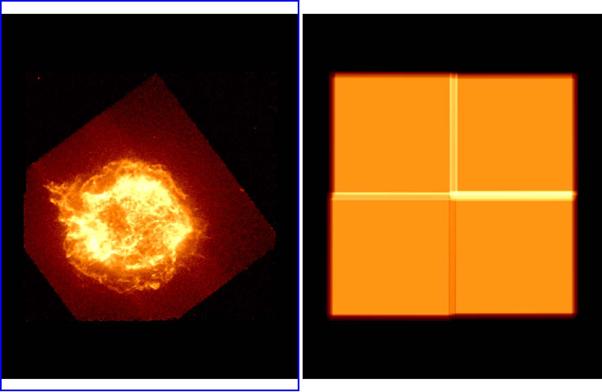

.. _mosaic:

Making Mosaics of SOXS Images
-----------------------------

.. warning::

    This is a currently experimental feature--please report any bugs to the
    `SOXS issues page <https://github.com/lynx-x-ray-observatory/soxs/issues>`_.

.. note::

    This functionality requires the `reproject <https://reproject.readthedocs.io/>`_ 
    package to be installed.

SOXS has two functions to create a mosaic of simulated X-ray observations from 
the same source. To create a mosaic event files from a single source, use the 
:func:`~soxs.mosaic.make_mosaic_events` function. We'll use a SIMPUT catalog
from a Chandra image of Cas A (which you can get 
`here <https://www.sternwarte.uni-erlangen.de/research/sixte/simput/casa.simput.gz>`_, 
and make four pointings using the *Lynx* LXM.

.. code-block:: python

    import soxs

    # This is a list of tuples of RA, Dec aimpoints of the different
    # pointings
    
    pointing_list = [
        (350.917572, 58.79338837),
        (350.755960, 58.79442533),
        (350.914650, 58.87563736),
        (350.755584, 58.87498051)
    ]

    obs_list = soxs.make_mosaic_events(pointing_list, "casa.simput", "casa", 
                                       (1.0,"ks"), "lynx_lxm", overwrite=True)
        
:func:`~soxs.mosaic.make_mosaic_events` takes nearly all of the parameters 
which can be supplied to the :func:`~soxs.instrument.instrument_simulator`
function, see :ref:`mosaic-api` for details.

For the list of pointings, one could also create an ASCII table that contains
the list of pointings that looks like this, and supply the filename as the
``pointing_list`` argument:

.. code-block::

    # RA Dec
    350.917572 58.79338837
    350.755960 58.79442533  
    350.914650 58.87563736
    350.755584 58.87498051

What is returned in ``obs_list`` is an ASCII table of RA, Dec and the name of 
the event file corresponding to each pointing. To create a single mosaic image
from these event files, this list needs to be fed into the 
:func:`~soxs.mosaic.make_mosaic_image` function:

.. code-block:: python

    soxs.make_mosaic_image(obs_list, "casa_all_image.fits", overwrite=True)
    
Which will create an image of each pointing, save it to disk, and then combine
them into a final image.

Optionally, if you provide a filename to the ``evt_file`` argument, the events from
the separate files will be combined into a single event file:

.. code-block:: python

    soxs.make_mosaic_image(obs_list, "casa_all_image.fits", evt_file="casa_all_evt.fits",
                           overwrite=True)

:func:`~soxs.mosaic.make_mosaic_image` takes many parameters which can be 
supplied to :func:`~soxs.events.write_image`, and also allows one to create an
exposure map, so it also takes several parameters which are supplied to 
:func:`~soxs.events.make_exposure_map`. Here is an example of making a mosaicked
image which has been reblocked by a factor of 2 and created with an exposure map:

.. code-block:: python
    
    soxs.make_mosaic_image(obs_list, "casa_all_image.fits", overwrite=True, 
                           use_expmap=True, expmap_energy=1.5, reblock=2)
                        
In this case, an exposure map is made for each pointing, these files are combined
into a single exposure map, and the mosaicked counts image is divided by the map
to create a flux image, which is also saved to disk. These are the results in ds9:

For other options, see :ref:`mosaic-api`.

