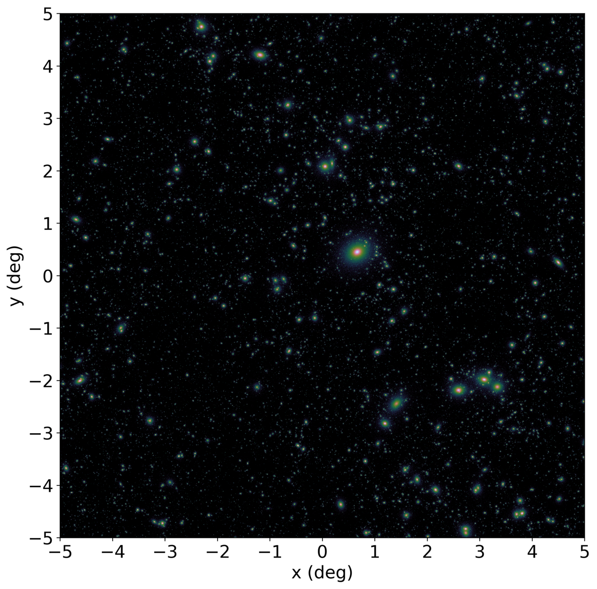

.. _source-catalogs:

Simulating Source Catalogs
==========================

SOXS has the capability of simulating two different types of source catalogs:
X-rays from a population of halos (galaxies, galaxy groups, and galaxy 
clusters), and point sources. 

.. _cosmo-source-catalog:

Cosmological Source Catalog
---------------------------

SOXS provides a routine to generate X-ray photons from cosmologically distant 
sources. This is made possible using a halo catalog provided by Daisuke Nagai 
(Yale) and Masato Shirasaki (NAOJ). The halo catalog is extracted from a light
cone simulation produced using the methods of 
`Shirasaki et al. (2015) <http://adsabs.harvard.edu/abs/2015ApJ...799..188S>`_. 
It includes :math:`M_{500c}`, :math:`z`, and center coordinates for each halo.

The light cone simulation of :math:`10 \times 10` square degrees is produced 
from two N-body simulation boxes with :math:`L = 480~\rm{Mpc/h}` and
:math:`L = 960~\rm{Mpc/h}`, out to the maximum redshift of z = 3, performed with
the Gadget-2 code `(Springel 2005) <http://adsabs.harvard.edu/abs/2005MNRAS.364.1105S>`_. 
Each simulation box contains :math:`1024^3` dark matter particles. Halo finding 
was performed using Rockstar 
`(Behroozi et al. 2013) <http://adsabs.harvard.edu/abs/2013ApJ...762..109B>`_, 
and only host halos were used and not subhalos.

The cosmological parameters for this halo catalog are from the WMAP 9-year 
cosmology `Hinshaw et al. 2013 <http://adsabs.harvard.edu/abs/2013ApJ...771..137M>`_:

* :math:`h = 0.7`
* :math:`\Omega_m = 0.279`
* :math:`\Omega_\Lambda = 0.721`
* :math:`\Omega_b = 0.0463`
* :math:`w_{\rm DE} = -1`
* :math:`\sigma_8 = 0.823`
* :math:`n_s = 0.972`

The X-ray emitting intracluster medium for each halo is modeled using a 
:math:`\beta`-model function for the surface brightness and assuming 
isothermality. Using scaling relations from
`Vikhlinin et al. (2009) <http://adsabs.harvard.edu/abs/2009ApJ...692.1033V>`_,
the halo temperature and flux are derived from the halo mass and redshift,
assuming an APEC model for the spectrum. The scale radius of each halo is given
by :math:`r_{500c}/10`. The :math:`\beta`-parameter for each halo is drawn from
a normal distribution with mean 2/3 and standard deviation 0.05. Each halo is
also given a random ellipticity from a Gaussian distribution of mean 0.85 and
standard deviation 0.15, and the orientation of this ellipticity is drawn from
a uniform distribution over the range :math:`[0, 2\pi]`.

A low-mass cut has been made at :math:`M_{500c} = 3 \times 10^{12}~M_\odot`.

Flat-Field Map of Structure
+++++++++++++++++++++++++++

Below is a map showing an image of the full flat-field :math:`10 \times 10` 
degree sky flux map (in the 0.5-2 keV band) of the X-ray halos in the catalog.

A FITS image of this map (in units of :math:`\rm{photons~s^{-1}~cm^{-2}}` in the
0.5-2 keV band) can be downloaded from the link below, which you can open in ds9
to select regions of interest and determine coordinates to be passed into the
``cat_center`` parameter of :func:`~soxs.cosmology.make_cosmological_sources_file`.
A full ASCII table of the halos in the catalog and their properties is also provided.

* `FITS image of sources <http://hea-www.cfa.harvard.edu/soxs/full_map.fits.gz>`_
* `ASCII table of source properties <http://hea-www.cfa.harvard.edu/soxs/all_halos.dat>`_

.. note::

    In the observations you create, the ellipticities and orientations of the
    halos will be different from those in this map. This map is provided as a
    convenience to locate which regions may show interesting structure. 

``make_cosmological_sources_file``
++++++++++++++++++++++++++++++++++

:func:`~soxs.cosmology.make_cosmological_sources_file` generates a photon list
file for a SIMPUT catalog using the cosmological sources model:

.. code-block:: python

    filename = "cosmo.simput"
    name = "my_cosmo_sources"
    exp_time = (500.0, "ks") 
    fov = 20.0 # arcmin
    sky_center = [30.0, 45.0] # RA, Dec in degrees
    absorb_model = "wabs" # Choose a model for absorption, optional
    nH = 0.02 # Foreground galactic absorption, optional
    area = (4.0, "m**2") # Flat collecting area to generate photon sample
    soxs.make_cosmological_sources_file(filename, name, exp_time, fov, sky_center,
                                        absorb_model=absorb_model, nH=nH, 
                                        area=area)

To append to an existing catalog ``filename``, set ``append=True``. If you 
want to write the cosmological sources to a separate file, use the 
``src_filename`` keyword argument.

By default, a random position will be chosen within the halo catalog. If you 
would prefer to simulate a specific region within the catalog, set the keyword
argument ``cat_center`` to a particular coordinate between [-5, 5] degrees in 
either direction:

.. code-block:: python

    cat_center = [-0.2, 3.0]
    soxs.make_cosmological_sources_file(filename, name, exp_time, fov, sky_center, 
                                        absorb_model=absorb_model, nH=nH, 
                                        area=area, cat_center=cat_center)

One can also write out `ds9 <https://ds9.si.edu>`_ circle regions corresponding to
the positions of the halos on the sky, with the radii of the circles given by the
:math:`r_{500}` of the halos, using the ``write_regions`` argument:

.. code-block:: python

    soxs.make_cosmological_sources_file(filename, name, exp_time, fov, sky_center, 
                                        absorb_model=absorb_model, nH=nH, 
                                        area=area, write_regions="halos.reg")

.. _point-source-catalog:

Point Source Catalog
--------------------

SOXS also provides a function to create a SIMPUT catalog of point-sources. 
It is not necessary to do this for including point sources as a background
component in SOXS, as this will be done automatically, but it may be useful 
if you would like to tweak parameters of the sources, store the positions and
fluxes of the sources generated, or use the SIMPUT catalog in another simulation
program such as MARX or SIMX. 

:func:`~soxs.background.point_sources.make_point_sources_file` generates a
photon list file for a SIMPUT catalog using the point-source background model
described in :ref:`ptsrc-bkgnd`:

.. code-block:: python

    filename = "pt_src.simput"
    name = "my_point_sources"
    exp_time = (500.0, "ks") 
    fov = 20.0 # arcmin
    sky_center = [30.0, 45.0] # RA, Dec in degrees
    absorb_model = "tbabs" # Choose a model for absorption, optional
    nH = 0.02 # Foreground galactic absorption, optional
    area = (4.0, "m**2") # Flat collecting area to generate photon sample
    soxs.make_point_sources_file(filename, name, exp_time, fov, sky_center, 
                                 absorb_model=absorb_model, nH=nH, 
                                 area=area)

To append to an existing catalog ``filename``, set ``append=True``. If you 
want to write the cosmological sources to a separate file, use the 
``src_filename`` keyword argument.

A uniform background across the field of view, associated with many completely 
unresolved point sources, is also added, with a spectral index of :math:`\alpha = 2.0` 
and a flux of :math:`1.352 \times 10^{-12}~\rm{erg}~\rm{s}^{-1}~\rm{cm}^{-2}~\rm{deg}^{-2}` 
in the 0.5-2 keV band. This can be turned off by setting ``diffuse_unresolved=False`` in the
call to :func:`~soxs.background.point_sources.make_point_sources_file`.

.. _point-source-list:

Saving the Point Source Properties to Disk for Later Use
++++++++++++++++++++++++++++++++++++++++++++++++++++++++

One can also save the point-source properties to disk for examination or later use
to generate a consistent set of point sources more than once. This can be done in two
different ways. The first is via :func:`~soxs.background.point_sources.make_point_sources_file`
itself, using the ``output_sources`` keyword argument:

.. code-block:: python

    filename = "pt_src.simput"
    name = "my_point_sources"
    exp_time = (500.0, "ks")
    fov = 20.0 # arcmin
    sky_center = [30.0, 45.0] # RA, Dec in degrees
    
    soxs.make_point_sources_file(filename, name, exp_time, fov, 
                                 sky_center, output_sources="my_srcs.dat")

This saves the point source properties of position, flux, and spectral index
to an ASCII table file, as a side effect of generating the point source events.
However, one may want to simply generate this table without generating events, 
so SOXS also provides the :func:`~soxs.background.point_sources.make_point_source_list`
method:

.. code-block:: python

    output_file = "my_srcs.dat"
    fov = 20.0 # arcmin
    sky_center = [30.0, 45.0] # RA, Dec in degrees
    
    soxs.make_point_source_list(output_file, fov, sky_center)

Regardless of which method used, this ASCII table can be used as input to
:func:`~soxs.background.point_sources.make_point_sources_file` via the
``input_sources`` keyword argument, e.g.:

.. code-block:: python

    filename = "pt_src.simput"
    name = "my_point_sources"
    exp_time = (500.0, "ks")
    fov = 20.0 # arcmin
    sky_center = [30.0, 45.0] # RA, Dec in degrees
    
    soxs.make_point_sources_file(filename, name, exp_time, fov, 
                                 sky_center, input_sources="my_srcs.dat")

Which ensures that one would have the same set of point sources every time it is
run. You can also pass this file to the ``input_pt_sources`` keyword argument of
:func:`~soxs.instrument.instrument_simulator` or 
:func:`~soxs.instrument.make_background_file`.