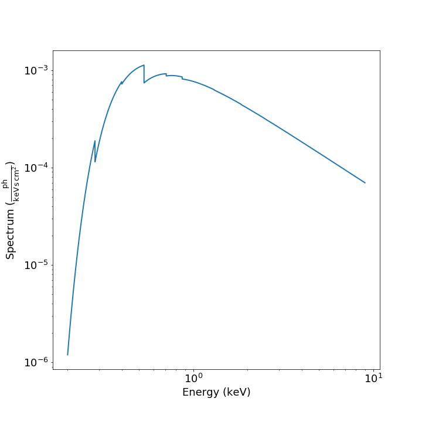

.. _spectra:

Creating and Using Spectra
==========================

SOXS provides a way to create common types of spectra that can then be
used in your scripts to create mock observations via the 
:class:`~soxs.spectra.Spectrum` object.

.. _spectrum-binning:

Spectrum Binning
----------------

The energy binning of spectral tables can be either linear or log--that is,
either the difference between the minimum and maximum energies of each bin is
constant across the spectrum (linear) or that the difference between the logarithm
of the minimum and maximum energies of each bin is constant across the spectrum
(log).

For most of the spectrum creation methods outlined below, there will be the following
keyword arguments to control the binning of spectral tables:

* ``emin``: The minimum energy of the spectral table in keV.
* ``emax``: The maximum energy of the spectral table in keV.
* ``nbins``: The number of bins in the spectrum.
* ``binscale``: An optional argument which takes either ``"linear"`` or ``"log"``.
  The default is always ``"linear"``.

You cannot convert the binning of spectra, or combine two spectra which have different
binnings.

Creating Spectrum Objects
-------------------------

A :class:`~soxs.spectra.Spectrum` object is simply defined by a table 
of energies and photon fluxes. There are several ways to create a 
:class:`~soxs.spectra.Spectrum`, depending on your use case. 

Creating a Constant Spectrum
++++++++++++++++++++++++++++

A simple constant spectrum can be created using the 
:meth:`~soxs.spectra.Spectrum.from_constant` method. This takes as input the 
value of the flux ``const_flux``, which is in units of 
:math:`{\rm photons}~{\rm cm}^{-2}~{\rm s}^{-1}~{\rm keV}^{-1}`. The parameters
``emin``, ``emax``, ``nbins``, and ``binscale`` are used to control the binning.

.. code-block:: python

    const_flux = 1.0e-7
    emin = 0.1
    emax = 10.0
    nbins = 20000
    spec = Spectrum.from_constant(const_flux, emin, emax, nbins, binscale="linear")

Creating a Power-Law Spectrum
+++++++++++++++++++++++++++++

A simple power-law spectrum can be created using the 
:meth:`~soxs.spectra.Spectrum.from_powerlaw` method. This takes as input
a spectral index ``photon_index``, a redshift ``redshift``, and a normalization
of the source ``norm`` at 1 keV in the source frame, in units of 
:math:`{\rm photons}~{\rm cm}^{-2}~{\rm s}^{-1}~{\rm keV}^{-1}`. Mathematically, 
this is equivalent to:

.. math::

    F_E = K\left[\frac{E(1+z)}{{\rm 1~keV}}\right]^{-\alpha}
    
where :math:`\alpha` is the ``photon_index`` (note the sign convention). The parameters
``emin``, ``emax``, ``nbins``, and ``binscale`` are used to control the binning.

You can set up a power-law spectrum like this:

.. code-block:: python

    alpha = 1.2
    zobs = 0.05
    norm = 1.0e-7
    emin = 0.1
    emax = 10.0
    nbins = 20000
    spec = Spectrum.from_powerlaw(alpha, zobs, norm, emin, emax, nbins, binscale="log")

.. _thermal-spectra:

Generating Thermal Spectra
++++++++++++++++++++++++++

Thermal spectra are generated in SOXS using the 
`AtomDB tables <http://www.atomdb.org>`_, and require special handling. The 
:class:`~soxs.apec.ApecGenerator` class is a factory class which generates 
new :class:`~soxs.spectra.Spectrum` objects. You start by initializing an 
:class:`~soxs.apec.ApecGenerator` object:

.. code-block:: python

    from soxs import ApecGenerator
    emin = 0.05
    emax = 50.0
    nbins = 10000
    agen = ApecGenerator(emin, emax, nbins, apec_vers="2.0.2", broadening=True)

The parameters ``emin``, ``emax``, ``nbins``, and ``binscale`` are used to
control the binning.

The ``broadening`` parameter sets whether or not spectral lines will be 
thermally and velocity broadened. The ``apec_vers`` parameter sets the version 
of the AtomDB tables to use. Version 3.0.9 is the default, and the tables will
be downloaded if necessary. 

You may also supply another location for the AtomDB tables. For example, the 
following construction will look for the AtomDB tables in the current working 
directory:

.. code-block:: python

    agen = ApecGenerator(0.05, 50.0, 10000, apec_root=".")

If you set the ``apec_vers`` parameter but not the ``apec_root`` parameter, the
AtomDB table files will be looked for in (1) the current working directory and
(2) the location specified by ``soxs_data_dir`` in the :ref:`config`.

Once you have an :class:`~soxs.apec.ApecGenerator` object, you can use it to
generate thermal spectra using the :meth:`~soxs.apec.ApecGenerator.get_spectrum`
method. The parameters are:

* ``kT``: The temperature of the plasma, with default units of keV
* ``abund``: The metal abundance, in solar units. Includes C, N, O, Ne, Mg, Al, 
  Si, S, Ar, Ca, Fe, Ni (He fixed at cosmic, other trace elements fixed at solar). 
  See :ref:`var-abund` below for more fine-grained control of abundances.
* ``redshift``: The redshift of the plasma
* ``norm``: The normalization of the model, assuming the standard prescription of
  :math:`10^{-14}\int{n_en_p}dV/[4\pi(1+z)^2D_A^2]` where :math:`n_e` and 
  :math`n_p` are the electron and proton number densities, :math:`z` is the 
  redshift, and :math:`D_A` is the angular diameter distance to the source. All
  units are in cgs. 
* ``velocity``:

.. code-block:: python
    
    kT = 6.0 (6.0, "keV")
    abund = 0.3 # solar units
    redshift = 0.05
    norm = 1.0e-3 
    velocity = (100.0, "km/s") # optional
    spec1 = agen.get_spectrum(kT, abund, redshift, norm, velocity=velocity)

``spec1`` is just a standard :class:`~soxs.spectra.Spectrum` object.

.. _var-abund:

Variable Abundances
~~~~~~~~~~~~~~~~~~~

By default, :class:`~soxs.apec.ApecGenerator` assumes all abundances besides
H, He, and the trace elements are set to the value provided by the ``abund``
parameter. However, more fine-grained control is possible. 
:class:`~soxs.apec.ApecGenerator` accepts a ``var_elem`` optional argument
to specify which elements should be allowed to vary freely:

.. code-block:: python

    var_elem = ["O", "Ca"] # allow oxygen and calcium to vary freely 
    agen = ApecGenerator(0.05, 50.0, 10000, var_elem=var_elem, binscale="log")
    
Whatever elements are not specified here are assumed to be set as normal, whether
they are H, He, trace elements, or metals covered by the ``abund`` parameter. 
Now, spectra which are created from this :class:`~soxs.apec.ApecGenerator`
object using the :meth:`~soxs.apec.ApecGenerator.get_spectrum` method should 
set values for the abundances of these elements in solar units. This is done by 
supplying the ``elem_abund`` dict like so:

.. code-block:: python

    kT = 6.0
    abund = 0.3 # for all other metals
    redshift = 0.05
    norm = 1.0e-3 
    O_abund = 0.5
    Ca_abund = 0.4
    spec = agen.get_spectrum(kT, abund, redshift, norm,
                             elem_abund={"O": O_abund, "Ca": Ca_abund})

Note that setting the ``abund`` parameter is still necessary for the other
metals. 

.. _nei:

Non-Equilibrium Ionization Spectra
~~~~~~~~~~~~~~~~~~~~~~~~~~~~~~~~~~

A variation on specifying variable abundances in SOXS allows one to construct
non-equilibrium ionization (NEI) spectra. In this case, all ions one desires to
contribute to the spectrum must be put in by hand, with the exception of H and
He, which may be specified, but if they are not they are assumed to be fully
ionized at their Solar abundances.

To create an :class:`~soxs.apec.ApecGenerator` object which produces NEI
spectra, one must specify not only the elements one wants but also their 
ionization states. The notation is to represent an ion by the element first, 
followed by the ``^`` symbol, followed by its ionization state. So for oxygen,
:math:`O^{+1}` would correspond to ``"O^1"``, and so on. The keyword argument 
``nei=True`` must also be set. An example using four oxygen ions and two 
nitrogen ions is shown below:

.. code-block:: python

    var_elem = ["O^1", "O^2", "O^3", "O^4", "N^4", "N^5"]
    agen = ApecGenerator(0.05, 10.0, 10000, var_elem=var_elem, nei=True)

Once this has been created, we use a special method for NEI spectra, 
:meth:`~soxs.apec.ApecGenerator.get_nei_spectrum`

.. code-block:: python

    kT = 5.0 
    norm = 1.0e-3 
    redshift = 0.0
    elem_abund = {"O^1": 0.3, "O^2": 0.5, "O^3": 0.2, "O^4": 0.5,
                  "N^4": 0.2, "N^5": 0.4}
    spec = agen.get_nei_spectrum(kT, elem_abund, redshift, norm)
    
.. warning::

    SOXS does not make any assumptions about the correctness of the relative ion
    abundances which you input into :meth:`~soxs.apec.ApecGenerator.get_nei_spectrum`.
    It assumes you have run a NEI code to determine the correct abundances, and
    only computes the spectrum.

.. _nolines:

APEC Spectra Without Lines
~~~~~~~~~~~~~~~~~~~~~~~~~~

There is also an option to generate continuum spectra only from the AtomDB
tables. This is done by setting ``nolines=True`` in the constructor for
:class:`~soxs.apec.ApecGenerator`:

.. code-block:: python

    agen = ApecGenerator(0.05, 50.0, 10000, nolines=True)

.. _solar-abund-tables:

Changing Abundance Tables
~~~~~~~~~~~~~~~~~~~~~~~~~

The abundance parameters discussed so far assume abundance of a particular 
element or a number of elements relative to the Solar value. Underlying this
are the values of the Solar abundances themselves. It is possible to change the
Solar abundance table in SOXS via the optional ``abund_table`` argument to 
:class:`~soxs.apec.ApecGenerator`. By default, SOXS uses the abundance table
set in the :ref:`config`, which by default are the
`Anders & Grevesse 1989 <http://adsabs.harvard.edu/abs/1989GeCoA..53..197A>`_ 
abundances. This corresponds to a setting of ``"angr"`` for this parameter, but it 
is possible to use other tables of solar abundances. The other tables included 
with SOXS are:

* ``"aspl"``: `Asplund et al. 2009 <http://adsabs.harvard.edu/abs/2009ARA%26A..47..481A>`_
* ``"wilm"``: `Wilms et al. 2000 <http://adsabs.harvard.edu/abs/2000ApJ...542..914W>`_
* ``"lodd"``: `Lodders 2003 <http://adsabs.harvard.edu/abs/2003ApJ...591.1220L>`_
* ``"feld"``: `Feldman 1992 <https://ui.adsabs.harvard.edu/abs/1992PhyS...46..202F>`_

The easiest way to ensure that you always use a particular abundance table is to
set it in the :ref:`config`. However, the Solar abundance table can be changed 
on-the-fly like this:

.. code-block:: python

    agen = ApecGenerator(0.05, 50.0, 10000, abund_table="aspl")

Alternatively, one can supply their own abundance table by providing a NumPy array, list,
or tuple of abundances 30 elements in length corresponding to the Solar abundances
relative to hydrogen in the order of H, He, Li, Be, B, C, N, O, F, Ne, Na, Mg, Al, Si, P,
S, Cl, Ar, K, Ca, Sc, Ti, V, Cr, Mn, Fe, Co, Ni, Cu, and Zn. An example:

.. code-block:: python

    my_abund = np.array([1.00E+00, 8.51E-02, 1.12E-11, 2.40E-11, 5.01E-10,
                         2.69E-04, 6.76E-05, 4.90E-04, 3.63E-08, 8.51E-05,
                         1.74E-06, 3.98E-05, 2.82E-06, 3.24E-05, 2.57E-07,
                         1.32E-05, 3.16E-07, 2.51E-06, 1.07E-07, 2.19E-06,
                         1.41E-09, 8.91E-08, 8.51E-09, 4.37E-07, 2.69E-07,
                         3.16E-05, 9.77E-08, 1.66E-06, 1.55E-08, 3.63E-08])

    agen = ApecGenerator(0.05, 50.0, 10000, abund_table=my_abund)

.. _xspec:

Generating a Spectrum from XSPEC
++++++++++++++++++++++++++++++++

If you have XSPEC installed on your machine, you can use it with SOXS to create 
any spectral model that XSPEC supports. You can do this in two ways. The first 
is by passing in a model string and a list of parameters to the 
:meth:`~soxs.spectra.Spectrum.from_xspec_model` method:

.. code-block:: python

    model_string = "phabs*(mekal+powerlaw)" # A somewhat complicated model
    params = [0.02, 6.0, 1.0, 0.3, 0.03, 1, 0.01, 1.2, 1.0e-3]
    emin = 0.1
    emax = 5.0
    nbins = 20000
    spec = Spectrum.from_xspec_model(model_string, params, emin, emax, nbins)
    
Note that the parameters must be in the same order that they would be if you 
were entering them in XSPEC. The parameters ``emin``, ``emax``, ``nbins``,
and ``binscale`` are used to control the binning.

The second way involves passing an XSPEC script file to the 
:meth:`~soxs.spectra.Spectrum.from_xspec_script` method which defines an XSPEC
model. For example, a script that creates a model spectrum from a sum of two 
APEC models may look like this:

.. code-block:: text

    statistic chi
    method leven 10 0.01
    abund angr
    xsect bcmc
    cosmo 70 0 0.73
    xset delta 0.01
    systematic 0
    model  apec    +   apec
                0.2       0.01      0.008      0.008         64         64
                  1     -0.001          0          0          5          5
                  0      -0.01     -0.999     -0.999         10         10
        6.82251e-07       0.01          0          0      1e+24      1e+24
              0.099       0.01      0.008      0.008         64         64
                  1     -0.001          0          0          5          5
                  0      -0.01     -0.999     -0.999         10         10
        1.12328e-06       0.01          0          0      1e+24      1e+24

If it is contained within the file ``"two_apec.xcm"``, it can be used to 
create a :class:`~soxs.spectra.Spectrum` like this:

.. code-block:: python

    emin = 0.1
    emax = 5.0
    nbins = 20000
    spec = Spectrum.from_xspec_script("two_apec.xcm", emin, emax, nbins,
                                      binscale="log")

The parameters ``emin``, ``emax``, ``nbins``, and ``binscale`` are used to
control the binning.

.. note::

    Generating spectra from XSPEC requires that the ``HEADAS`` environment variable
    is defined within your shell before running the Python script, as it would be 
    if you were using XSPEC to fit spectra. For example, for the ``zsh`` shell there
    should be a line like ``export HEADAS=${HOME}/heasoft-6.29/x86_64-apple-darwin21.1.0/``
    in your ``.zshrc`` file. 

Math with ``Spectrum`` Objects
------------------------------

Two :class:`~soxs.spectra.Spectrum` objects can be co-added, provided that
they have the same energy binning:

.. code-block:: python
 
    spec1 = Spectrum.from_powerlaw(1.1, 0.05, 1.0e-9, 0.1, 10.0, 10000)
    spec2 = agen.get_spectrum(6.0, 0.3, 0.05, 1.0e-3)

    total_spectrum = spec1 + spec2
    
If they do not, an error will be thrown. 

Or they can be subtracted:

.. code-block:: python

    diff_spectrum = spec1-spec2

You can also multiply a spectrum by a constant float number or divide it by one:

.. code-block:: python

    spec3 = 6.0*spec2
    spec4 = spec1/4.4

.. _band-ops:

Getting the Values and Total Flux of a Spectrum Within a Specific Energy Band
-----------------------------------------------------------------------------

A new :class:`~soxs.spectra.Spectrum` object can be created from a restricted
energy band of an existing one by calling the :meth:`~soxs.spectra.Spectrum.new_spec_from_band`
method:

.. code-block:: python
    
    emin = 0.5
    emax = 7.0
    subspec = spec.new_spec_from_band(emin, emax)

The :meth:`~soxs.spectra.Spectrum.get_flux_in_band` method can be used
to quickly report on the total flux within a specific energy band:

.. code-block:: python

    emin = 0.5
    emax = 7.0
    print(spec.get_flux_in_band(emin, emax))

which returns a tuple of the photon flux and the energy flux, showing:

.. code-block:: pycon

    (<Quantity 2.2215588675210208e-07 ph / (cm2 s)>, 
     <Quantity 7.8742710307246895e-16 erg / (cm2 s)>)

Finally, :class:`~soxs.spectra.Spectrum` objects are "callable", and if one
supplies a single energy or array of energies, the values of the spectrum
at these energies will be returned. AstroPy :class:`~astropy.units.Quantity`
objects are detected and handled appropriately.

.. code-block:: python

    print(spec(3.0)) # energy assumed to be in keV
    
.. code-block:: pycon

    <Quantity 2.830468922349541e-10 ph / (cm2 keV s)>

.. code-block:: python

    from astropy.units import Quantity
    # AstroPy quantity, units will be converted to keV internally
    e = Quantity([1.6e-9, 3.2e-9, 8.0e-9], "erg")          
    print(spec(e)) # energy assumed to be in keV
    
.. code-block:: pycon

    <Quantity [  9.47745587e-10,  4.42138950e-10,  1.61370731e-10] ph / (cm2 keV s)>

Rescaling the Normalization of a Spectrum
-----------------------------------------

You can rescale the normalization of the entire spectrum using the
:meth:`~soxs.spectra.Spectrum.rescale_flux` method. This can be 
helpful when you want to set the normalization of the spectrum by the 
total flux within a certain energy band instead. 

.. code-block:: python

    spec.rescale_flux(1.0e-9, emin=0.5, emax=7.0, flux_type="photons"):

``emin`` and ``emax`` can be used to set the band that the flux corresponds to.
If they are not set, they are assumed to be the bounds of the spectrum. The flux
type can be ``"photons"`` (the default) or ``"energy"``. In the former case, the
units of the new flux must be :math:`{\rm photons}~{\rm cm}^{-2}~{\rm s}^{-1}`,
and in the latter case the units must be 
:math:`{\rm erg}~{\rm cm}^{-2}~{\rm s}^{-1}`.

Applying Galactic Foreground Absorption to a Spectrum
-----------------------------------------------------

The :meth:`~soxs.spectra.Spectrum.apply_foreground_absorption` method
can be used to apply foreground absorption using the ``"wabs"`` or 
``"tbabs"`` models. It takes one required parameter, the hydrogen 
column along the line of sight, in units of :math:`10^{22}~{\rm cm}^{-2}`.
Once can optionally specify which absorption model to use using the ``"model"``
parameter (default is ``"wabs"``):

.. code-block:: python

    spec = Spectrum.from_powerlaw(1.1, 0.05, 1.0e-9, 0.1, 10.0, 10000)
    n_H = 0.02
    spec.apply_foreground_absorption(n_H, model="tbabs")

The flux in the energy bins will be reduced according to the absorption at a
given energy. Optionally, to model absorption intrinsic to a source or 
from a source intermediate between us and the source, one can supply an
optional ``redshift`` argument (default 0.0):

.. code-block:: python

    spec = Spectrum.from_powerlaw(1.1, 0.05, 1.0e-9, 0.1, 
                                  10.0, 10000)
    n_H = 0.02
    spec.apply_foreground_absorption(n_H, model="tbabs", redshift=0.05)

.. _emiss_lines:

Adding Emission Lines to a Spectrum
-----------------------------------

The :meth:`~soxs.Spectrum.add_emission_line` method adds a single Gaussian 
emission line to an existing :class:`~soxs.spectra.Spectrum` object. The 
line energy, line width, and amplitude of the line (the line strength or 
integral under the curve) must be specified. The formula for the emission 
line is:

.. math::

    f(E) = \frac{A}{\sqrt{2\pi\sigma^2}}\exp{\left[-\frac{(E-E_0)^2}{2\sigma^2}\right]}

where :math:`E_0` is the line center and the line width is

.. math::

    {\rm FWHM} = 2\sqrt{2\ln{2}}\sigma

.. code-block:: python

    spec = Spectrum.from_powerlaw(1.1, 0.05, 1.0e-9, 0.1, 
                                  10.0, 10000)
    line_center = (6.0, "keV") # "E_0" above
    line_width = (30.0, "eV") # "FWHM" above
    line_amp = (1.0e-7, "photon/s/cm**2") # "A" above
    spec.add_emission_line(line_center, line_width, line_amp)

The line width may also be specified in units of velocity, if that is more convenient:

.. code-block:: python

    spec = Spectrum.from_powerlaw(1.1, 0.05, 1.0e-9, 0.1, 
                                  10.0, 10000)
    line_center = (6.0, "keV")
    line_width = (200.0, "km/s")
    line_amp = (1.0e-7, "photon/s/cm**2")
    spec.add_emission_line(line_center, line_width, line_amp)

Currently, this functionality only supports emission lines with a Gaussian shape.

.. _absorb_lines:

Adding Absorption Lines to a Spectrum
-------------------------------------

The :meth:`~soxs.Spectrum.add_absorption_line` method adds a single Gaussian 
absorption line to an existing :class:`~soxs.spectra.Spectrum` object. The 
line energy, line width, and equivalent width of the line must be specified. 
The formula for the absorption line is given in terms of the optical depth
:math:`\tau(E)`:

.. math::

    \tau(E) = \frac{B}{\sqrt{2\pi\sigma^2}}\exp{\left[-\frac{(E-E_0)^2}{2\sigma^2}\right]}

where :math:`E_0` is the line center and the line width is

.. math::

    {\rm FWHM} = 2\sqrt{2\ln{2}}\sigma

and the strength of the absorption :math:`B` is

.. math::

    B = E_0^2\frac{\rm EW}{hc}

where :math:`{\rm EW}` is the equivalent width in angstroms. Then the unabsorbed 
spectrum :math:`f_0(E)` is multiplied by the absorption like so to produce the 
absorbed spectrum :math:`f(E)`:

.. math::

    f(E) = e^{-\tau(E)}f_0(E)

.. code-block:: python

    spec = Spectrum.from_powerlaw(1.1, 0.05, 1.0e-9, 0.1, 
                                  10.0, 10000)
    line_center = (1.0, "keV") # "E_0" above
    line_width = (30.0, "eV") # "FWHM" above
    equiv_width = 2 # defaults to units of milli-Angstroms
    spec.add_absorption_line(line_center, line_width, equiv_width)

The line width may also be specified in units of velocity, if that is more convenient:

.. code-block:: python

    spec = Spectrum.from_powerlaw(1.1, 0.05, 1.0e-9, 0.1, 
                                  10.0, 10000)
    line_center = (1.0, "keV")
    line_width = (500.0, "km/s")
    equiv_width = (3.0e-3, "Angstrom")
    spec.add_absorption_line(line_center, line_width, equiv_width)

Currently, this functionality only supports absorption lines with a Gaussian shape.

Generating Photon Energies From a Spectrum
------------------------------------------

Given a :class:`~soxs.spectra.Spectrum`, a set of photon energies can be 
drawn from it using the :meth:`~soxs.spectra.Spectrum.generate_energies`
method. This will most often be used to generate discrete samples for mock 
observations. For this method, an exposure time and a constant 
(energy-independent) effective area must be supplied to convert the spectrum's 
flux to a number of photons. These values need not be realistic--in fact, they 
both should be larger than the values for the mock observation that you want to 
simulate, to create a statistically robust sample to draw photons from when we 
actually pass them to the instrument simulator.

An example using a :class:`~soxs.spectra.Spectrum` created from a file:

.. code-block:: python

    spec = Spectrum.from_file("my_spec.dat")
    t_exp = (100., "ks") # exposure time
    area = (3.0, "m**2") # constant effective area
    energies = spec.generate_energies(t_exp, area)

The ``energies`` object :meth:`~soxs.spectra.Spectrum.generate_energies` returns 
is an augmented NumPy array which also carries the unit information and the total 
flux of energies:

.. code-block:: python

    print(energies.unit)
    print(energies.flux)

.. code-block:: pycon

    Unit("keV")
    <Quantity 1.1256362913845828e-15 erg / (cm2 s)>

Normally, :meth:`~soxs.spectra.Spectrum.generate_energies` will not need to be 
called by the end-user but will be used "under the hood" in the generation of
a :class:`~soxs.simput.PhotonList` as part of a :class:`~soxs.simput.SimputCatalog`.
See :ref:`simput` for more information.

.. _convolved-spectra:

"Convolved" Spectra
-------------------

One may want to examine a spectrum after it has been convolved with a particular
effective area curve. One can generate such a 
:class:`~soxs.spectra.ConvolvedSpectrum` using the 
:meth:`~soxs.spectra.ConvolvedSpectrum.convolve` method, feeding it a 
:class:`~soxs.spectra.Spectrum` object and an ARF:

.. code-block:: python

    from soxs import ConvolvedSpectrum
    # Assuming one created an ApecGenerator agen...
    spec2 = agen.get_spectrum(6.0, 0.3, 0.05, 1.0e-3)
    cspec = ConvolvedSpectrum.convolve(spec2, "xrs_hdxi_3x10.arf")
    
The spectrum in this object has units of 
:math:`{\rm photons}~{\rm s}^{-1}~{\rm keV}^{-1}`, and one can use many of 
:class:`~soxs.spectra.Spectrum`'s methods on it. For example, to determine the 
count and energy rate within a particular band:

.. code-block:: python

    cspec.get_flux_in_band(0.5, 7.0)

.. code-block:: python

    (<Quantity 6.802363401824924 ph / s>,
     <Quantity 1.2428592072628134e-08 erg / s>)

Or to generate an array of energies:

.. code-block:: python

    t_exp = (500.0, "ks")
    e = cspec.generate_energies(t_exp)

If one has already loaded a :class:`~soxs.instrument.AuxiliaryResponseFile`,
then one can also generate a :class:`~soxs.spectra.ConvolvedSpectrum` by simply
multiplying the ARF by a :class:`~soxs.spectra.Spectrum` object:

.. code-block:: python

    from soxs import AuxiliaryResponseFile
    arf = AuxiliaryResponseFile("xrs_hdxi_3x10.arf")
    # Assuming one created an ApecGenerator agen...
    spec2 = agen.get_spectrum(6.0, 0.3, 0.05, 1.0e-3)
    cspec = spec2*arf

To "deconvolve" a :class:`~soxs.spectra.ConvolvedSpectrum` object and return
a :class:`~soxs.spectra.Spectrum` object, simply call 
:meth:`~soxs.spectra.ConvolvedSpectrum.deconvolve`:

.. code-block:: python

    spec_new = cspec.deconvolve()

.. _spectra-plots:

Plotting Spectra
----------------

All :class:`~soxs.spectra.Spectrum` objects and their associated subclasses have
a :meth:`~soxs.spectra.Spectrum.plot` method which can be used to make a 
`Matplotlib <http://www.matplotlib.org>`_ plot. The :meth:`~soxs.spectra.Spectrum.plot` 
method has no required arguments, but has a number of optional arguments for plot
customization. This method returns a tuple of the :class:`~matplotlib.figure.Figure` and 
the :class:`~matplotlib.axes.Axes` objects to allow for further customization. This
example shows how to make a simple plot of an absorbed power-law spectrum:

.. code-block:: python

    spec = soxs.Spectrum.from_powerlaw(1.2, 0.02, 1.0e-3, 0.2, 9.0, 100000)
    spec.apply_foreground_absorption(0.1)
    fig, ax = spec.plot()

Here's another example of creating a plot of two thermal spectra with labels, 
zooming in on a section of it, and setting the energy scale to linear:

.. code-block:: python

    agen = soxs.ApecGenerator(0.1, 10.0, 10000)
    spec1 = agen.get_spectrum(5.0, 0.3, 0.02, 1.0e-3)
    spec2 = agen.get_spectrum(3.0, 0.3, 0.02, 1.0e-3)
    fig, ax = spec1.plot(xmin=0.7, xmax=1.5, ymin=1.0e-4, ymax=3.0e-3, 
                         xscale='linear', label="5 keV plasma")
    spec2.plot(fig=fig, ax=ax, label="3 keV plasma")

.. image:: ../images/plot_two_spectra.png

For other customizations, consult the :meth:`~soxs.spectra.Spectrum.plot` API. 

.. _write-spectra:

Writing a Spectrum to Disk
--------------------------

:class:`~soxs.spectra.Spectrum` objects can be written to disk in three formats:
an ASCII text file in the ECSV format, a FITS file, or an HDF5 file. To write a 
spectrum to an ASCII ECSV file, use the :meth:`~soxs.spectra.Spectrum.write_ascii_file` 
method:

.. code-block:: python

    agen = soxs.ApecGenerator(0.1, 10.0, 10000)
    spec1 = agen.get_spectrum(5.0, 0.3, 0.02, 1.0e-3)
    spec1.write_ascii_file("my_spec.ecsv", overwrite=True)

To write a spectrum to an HDF5 file, use :meth:`~soxs.spectra.Spectrum.write_hdf5_file`:

.. code-block:: python

    agen = soxs.ApecGenerator(0.1, 10.0, 10000)
    spec1 = agen.get_spectrum(5.0, 0.3, 0.02, 1.0e-3)
    spec1.write_hdf5_file("my_spec.h5", overwrite=True)

To write a spectrum to a FITS file, use :meth:`~soxs.spectra.Spectrum.write_fits_file`:

.. code-block:: python

    agen = soxs.ApecGenerator(0.1, 10.0, 10000)
    spec1 = agen.get_spectrum(5.0, 0.3, 0.02, 1.0e-3)
    spec1.write_fits_file("my_spec.fits", overwrite=True)

In each case, the minimum and maximum energies for each bin in the table, the
flux in each bin (as well as its units), and the bin scaling (linear or log)
is written to the file. If writing a :class:`~soxs.spectrum.ConvolvedSpectrum`
object, the name of the ARF which was used to do the convolution is also stored.

.. _read-spectra: 

Reading a Spectrum from Disk
----------------------------

:class:`~soxs.spectra.Spectrum` objects written using any of the writing methods
detailed above (ASCII ECSV, HDF5, or FITS) can be the spectrum can be read back 
in again in, using :meth:`~soxs.spectra.Spectrum.from_file`:

.. code-block:: python

    from soxs import Spectrum
    my_spec = Spectrum.from_file("my_spec.ecsv")
